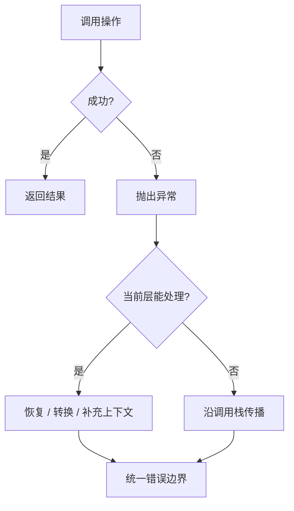

# 异常处理：异常体系、try/catch/finally、throw/throws 与自定义异常

> 课件来源：《第5章 异常.pptx》。本文逐项覆盖课件目录，并依据 Java SE 26、JDK 25 LTS 及相关官方文档补充现代工程实践。

异常用于沿调用栈传播“当前操作没有按契约完成”的信息。正确的异常设计要保留原因、区分可恢复性并保证资源释放。

## 1. 学习目标

- 区分 Error、受检异常与运行时异常。
- 正确使用捕获、重新抛出、异常链和 try-with-resources。
- 设计有业务语义的自定义异常和稳定错误边界。
- 避免吞异常、过度捕获和 finally 覆盖异常。

## 2. 知识结构



## 3. 逐项详解

### 1. Throwable 体系

`Throwable` 分为 `Error` 与 `Exception`。Error 通常表示 JVM 或环境级严重问题；RuntimeException 及其子类为非受检异常；其他 Exception 多为受检异常，编译器要求捕获或声明。

**工程理解：** 是否受检不能简单等同于是否可恢复；API 应根据调用者能否采取有意义行动决定异常契约。

**常见误区：** 捕获 `Throwable` 或 `Error` 后继续运行，隐藏内存耗尽等严重状态。

### 2. 运行时异常与受检异常

空引用、非法参数、越界和非法状态常用 RuntimeException 表示编程或契约错误；文件、网络等外部失败常以受检异常提示调用者处理。

**工程理解：** 在系统边界把底层异常转换为领域异常或稳定错误响应，同时保留 cause。

**常见误区：** 所有异常一律包装为 RuntimeException，导致调用者失去语义和恢复策略。

### 3. try/catch 与匹配顺序

catch 按从上到下匹配第一个兼容类型；子类必须放在父类之前。multi-catch 可用 `catch (A | B e)` 合并相同处理。

**工程理解：** 只捕获当前层真正能处理、补充上下文或转换的异常；否则让其继续传播。

**常见误区：** 写空 catch，或只打印堆栈后把失败当成功返回。

### 4. finally 的保证与限制

finally 通常在 try/catch 退出前执行，但进程被强制终止等情况例外。finally 中 return 或再次抛出会覆盖原始返回值/异常。

**工程理解：** 资源释放优先 try-with-resources，finally 只处理无法实现 AutoCloseable 的局部清理。

**常见误区：** 在 finally 中 return，导致真正异常丢失。

### 5. throw 与 throws

`throw` 抛出具体 Throwable 对象；`throws` 声明方法可能传播的受检异常。重写方法不能扩大父方法声明的受检异常范围。

**工程理解：** 异常消息包含操作、关键标识和边界上下文，但去除密码、令牌和个人敏感数据。

**常见误区：** 抛出过于宽泛的 Exception，迫使每个调用者做无意义捕获。

### 6. 异常链与 suppressed exceptions

包装异常时使用构造器传入 cause。try-with-resources 若主体和 close 同时失败，主体异常为主，close 异常记录在 `getSuppressed()`。

**工程理解：** 日志记录一次完整异常链；上层增加业务上下文，下层保留技术原因。

**常见误区：** 只保留 `e.getMessage()` 而丢失堆栈和 cause。

### 7. 自定义异常

自定义异常应表达稳定业务类别，例如 `InsufficientBalanceException`，并携带可诊断但安全的数据。需要强制调用者处理时继承 Exception，否则继承 RuntimeException。

**工程理解：** 异常类型与 API 错误码分层：内部异常不直接暴露实现细节，外部响应保持可版本化。

**常见误区：** 为每个微小失败创建层层异常类型，或把 HTTP 状态码硬编码进领域异常。

### 8. 资源管理

实现 `AutoCloseable` 的资源可在 try-with-resources 中声明，并按声明逆序关闭。Java 9 起可引用已经 effectively final 的外部资源变量。

**工程理解：** 数据库连接、流、Socket、压缩包和文件系统句柄都必须有明确所有权和关闭点。

**常见误区：** 依赖 GC 关闭文件或连接，最终导致句柄和连接池耗尽。

## 3.9 try-with-resources 与异常链

```java
try (var reader = Files.newBufferedReader(path, StandardCharsets.UTF_8)) {
    return reader.readLine();
} catch (IOException e) {
    throw new ConfigurationLoadException("读取配置失败: " + path, e);
}
```


## 4. 现代 Java 校准

- 资源关闭首选 try-with-resources。
- 不要使用 `finalize()` 作为异常兜底或资源清理机制。
- 虚拟线程中的异常仍遵循普通调用栈规则；并发任务需要显式汇总失败。
- 日志、HTTP 响应和领域异常属于三个不同层次，避免直接透传实现细节。

## 5. 实践任务

1. 实现一个配置加载器，区分文件不存在、格式错误和业务校验失败。
2. 构造主体异常与 close 异常同时发生的 AutoCloseable，观察 suppressed exception。
3. 为 REST 接口设计统一错误响应并映射领域异常。

## 6. 掌握检查

- [ ] 能解释受检与非受检异常的设计取舍。
- [ ] 能保证异常链和原始堆栈得到保留。
- [ ] 能使用 try-with-resources 管理多个资源。
- [ ] 能指出吞异常和 finally-return 的后果。

## 参考资料

- [Java SE 26 API](https://docs.oracle.com/en/java/javase/26/docs/api/)
- [Java Tutorials: Exceptions](https://dev.java/learn/exceptions/)
- [Java Language Specification 26](https://docs.oracle.com/javase/specs/jls/se26/html/)
