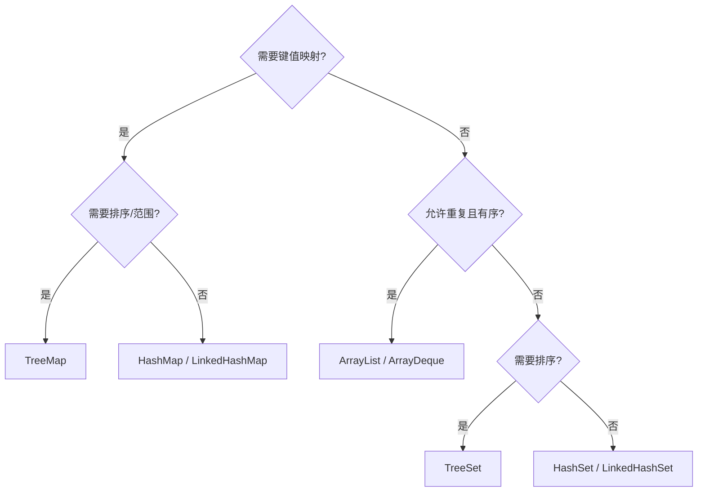

# Java 集合框架：Collection、List、Set、Map、遍历、工具类与 Lambda

> 课件来源：《第7章 集合.pptx》。本文逐项覆盖课件目录，并依据 Java SE 26、JDK 25 LTS 及相关官方文档补充现代工程实践。

集合选择的本质是数据语义与复杂度选择。本章覆盖 Collection、List、Set、Map、Iterator、foreach、Collections、Arrays 和 Lambda，并补充不可变集合与并发集合。

## 1. 学习目标

- 按顺序、唯一性、键值关系和并发需求选择集合。
- 理解 ArrayList、LinkedList、HashSet、TreeSet、HashMap 和 TreeMap 的核心约束。
- 正确遍历、删除、排序和构造不可变视图。
- 理解 equals/hashCode/Comparator 对集合行为的影响。

## 2. 知识结构



## 3. 逐项详解

### 1. 集合层次与语义

Collection 是元素容器根接口，List 有序可重复，Set 表达唯一性，Queue/Deque 表达队列和双端操作；Map 是键值映射并不继承 Collection。接口类型用于声明需求，具体实现负责性能与附加顺序语义。

**工程理解：** 方法参数和返回值优先最小接口；需要稳定迭代顺序时明确选 LinkedHash 系列或排序集合。

**常见误区：** 只凭“速度快”默认 HashMap/HashSet，忽略顺序、并发、空值和键可变性。

### 2. ArrayList 与 LinkedList

ArrayList 基于动态数组，随机访问快、尾部追加摊销 O(1)、中间插入删除需移动元素。LinkedList 是双向链表，同时实现 Deque；按索引访问 O(n)，节点对象和缓存局部性开销较大。

**工程理解：** 大多数通用列表优先 ArrayList；真正的队首尾队列操作使用 ArrayDeque，少把 LinkedList 当性能默认项。

**常见误区：** 看到“中间插入 O(1)”就选 LinkedList，却忽略先找到节点需要 O(n)。

### 3. Iterator、增强 for 与结构修改

增强 for 对 Iterable 使用 Iterator。迭代期间直接调用集合结构修改方法可能触发 fail-fast `ConcurrentModificationException`；使用 Iterator.remove、removeIf 或创建新集合。

**工程理解：** fail-fast 是错误探测，不是线程安全保证；并发读写选择同步边界或并发集合。

**常见误区：** 把 ConcurrentModificationException 当成确定的并发控制机制。

### 4. HashSet、LinkedHashSet 与 TreeSet

HashSet 依赖 hashCode/equals 判重；LinkedHashSet 额外维护插入顺序；TreeSet 依赖自然顺序或 Comparator，操作通常 O(log n)。比较器返回 0 时 TreeSet 视元素等价。

**工程理解：** 放入哈希集合后不要改变参与 equals/hashCode 的字段；排序规则与业务相等语义要一致或明确区别。

**常见误区：** 只重写 equals 不重写 hashCode，或比较器只比较一个非唯一字段造成元素“消失”。

### 5. HashMap 与 LinkedHashMap

HashMap 使用哈希桶，平均 get/put O(1)，冲突严重时桶可树化；允许一个 null key 和多个 null value。LinkedHashMap 可维护插入顺序或访问顺序，适合构造受控 LRU 结构。

**工程理解：** 键应稳定且相等契约正确；容量估算要基于元素规模和负载因子，避免反复扩容。

**常见误区：** 在多线程中无保护共享 HashMap，或用可变对象做 key 后修改关键字段。

### 6. TreeMap、Properties 与枚举集合

TreeMap 按 key 排序并提供范围查询；Properties 是遗留字符串配置容器，现代配置通常有更强类型映射；EnumSet/EnumMap 对枚举键做紧凑高效表示。

**工程理解：** 范围检索用 NavigableMap API；枚举状态集合优先 EnumSet 而非 HashSet。

**常见误区：** 把 Properties 当任意对象 Map，或忘记 TreeMap 比较器必须满足一致性。

### 7. Collections、Arrays 与不可修改集合

Collections 提供排序、查找、反转、包装视图；Arrays 提供数组排序、比较、复制和转 List。`List.of` 等工厂创建不可修改集合且拒绝 null；`unmodifiableList` 只是底层集合的只读视图。

**工程理解：** 跨边界返回不可修改副本，使用 `List.copyOf` 隔离后续变化。

**常见误区：** 把 `Arrays.asList` 当可增删 ArrayList，或把只读视图误解为深度不可变快照。

### 8. Lambda、方法引用与 Stream 边界

Lambda 是函数式接口实例，捕获的局部变量必须 effectively final。Stream 描述惰性流水线，不是集合；中间操作直到终止操作才执行，并行流需要无共享可变状态。

**工程理解：** 简单转换、过滤、汇总适合 Stream；复杂控制流和有副作用逻辑使用清晰循环。

**常见误区：** 在 forEach 中堆积业务副作用，或默认 parallelStream 一定更快。

### 9. 并发集合

ConcurrentHashMap、CopyOnWriteArrayList、BlockingQueue 等提供特定并发语义。复合操作仍需使用 `compute`、`merge`、`putIfAbsent` 等原子 API。

**工程理解：** 根据读写比例、阻塞需求和一致性选择；先定义线程所有权再选容器。

**常见误区：** 使用线程安全集合后，把“先检查再执行”的多步逻辑误认为整体原子。

## 3.9 最小可运行示例

```java
Map<String, Long> counts = orders.stream()
    .collect(Collectors.groupingBy(
        Order::status,
        LinkedHashMap::new,
        Collectors.counting()));

List<Order> newest = orders.stream()
    .sorted(Comparator.comparing(Order::createdAt).reversed())
    .limit(20)
    .toList();
```

## 4. 现代 Java 校准

- 大多数通用 List 选择 ArrayList，队列选择 ArrayDeque，而不是机械使用 LinkedList。
- 不可修改集合与深度不可变对象是两层概念。
- 集合接口默认方法和 Stream 不能替代并发设计。
- JDK 21 起 SequencedCollection/Set/Map 为有序集合提供统一首尾访问模型。

## 5. 实践任务

1. 实现一个保留最近访问顺序的有界缓存，并测试淘汰顺序。
2. 构造可变 key 导致 HashMap 查找失败的案例，再改成 record key。
3. 分别用循环和 Stream 统计订单，比较可读性、异常处理和性能。

## 6. 掌握检查

- [ ] 能基于语义和复杂度选择集合。
- [ ] 能说明 equals/hashCode/Comparator 如何影响集合。
- [ ] 能安全地在遍历期间删除元素。
- [ ] 能区分不可修改视图、不可修改副本和并发集合。

## 参考资料

- [Java Collections Framework](https://docs.oracle.com/en/java/javase/26/core/java-collections-framework.html)
- [Java SE 26 API](https://docs.oracle.com/en/java/javase/26/docs/api/)
- [Dev.java Learn](https://dev.java/learn/)
