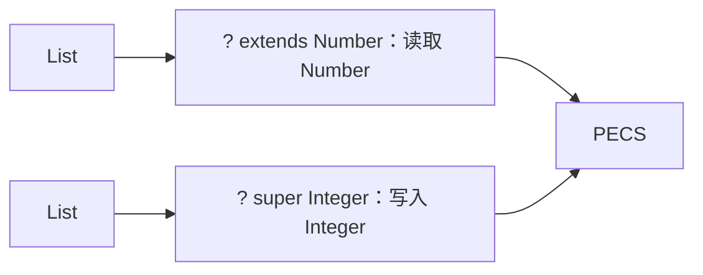

# Java 泛型：泛型类、接口、方法、通配符、边界与类型擦除

> 课件来源：《第8章 泛型.pptx》。本文逐项覆盖课件目录，并依据 Java SE 26、JDK 25 LTS 及相关官方文档补充现代工程实践。

泛型把类型错误提前到编译期，并减少强制转换。真正的难点是型变、通配符、边界和擦除后的限制。

## 1. 学习目标

- 定义并使用泛型类、接口和泛型方法。
- 理解不变性与 `? extends`/`? super`。
- 掌握类型推断、边界、擦除和桥接方法。
- 避免 raw type、heap pollution 和不安全可变参数。

## 2. 知识结构



## 3. 逐项详解

### 1. 泛型动机与参数化类型

`List<String>` 把元素类型写入静态契约，使编译器检查插入和读取。Java 泛型是不变的：即使 Integer 是 Number 子类，List<Integer> 也不是 List<Number> 子类。

**工程理解：** 公共 API 尽量完整声明类型参数，禁止无理由 raw type。

**常见误区：** 把泛型当作运行时自动类型转换，或假设容器类型协变。

### 2. 泛型类与接口

类型参数写在类/接口名后，可在字段、方法参数和返回值中使用。static 成员不能直接使用类的类型参数，因为它属于类本身而非某个参数化实例。

**工程理解：** 类型参数名遵循 T、E、K、V 或有语义的全名；避免一个类型上堆积过多相互依赖参数。

**常见误区：** 在 static 字段中使用 T，或创建职责不清的“万能泛型容器”。

### 3. 泛型方法与类型推断

泛型方法在返回类型前单独声明 `<T>`，与类是否泛型无关。编译器根据实参、目标类型和边界推断 T，必要时可显式写类型见证。

**工程理解：** 泛型方法让输入与输出关系可检查；若 T 只出现一次且不建立关系，通配符或普通基类可能更合适。

**常见误区：** 误把返回类型前的 `<T>` 省略，或让无意义 T 增加 API 复杂度。

### 4. 上界、下界与 PECS

`T extends Bound` 限制类型参数；`? extends T` 适合生产 T 的来源，安全读取但不能添加具体 T；`? super T` 适合消费 T 的目标，可写入 T，读取只保证 Object。PECS 是 Producer Extends, Consumer Super。

**工程理解：** 集合复制、比较器和回调 API 使用通配符提高可组合性，例如 `Comparator<? super T>`。

**常见误区：** 认为 extends 通配符集合完全只读，或试图从 super 通配符直接读出 T。

### 5. 无界通配符与捕获

`List<?>` 表示某个未知但一致的元素类型，比 raw `List` 安全。编译器可通过 wildcard capture 在私有辅助泛型方法中捕获这个未知类型。

**工程理解：** 只需读取 Object 或与元素类型无关的操作时用 `?`，而不是 raw type。

**常见误区：** 把 `List<?>` 与 `List<Object>` 等同；后者允许添加任意 Object。

### 6. 类型擦除与 reifiable 类型

多数泛型信息在编译后擦除为上界，并可能生成 bridge method 保持多态。运行时不能直接检查 `instanceof List<String>`，也不能 `new T()` 或创建 `new T[]`。

**工程理解：** 需要运行时类型时显式传入 `Class<T>`、TypeToken 或工厂函数。

**常见误区：** 以为每个参数化类型在 JVM 中都有独立类，或依赖被擦除的元素类型反射。

### 7. 泛型数组、可变参数与堆污染

数组协变且运行时检查元素类型，泛型不变且擦除，两者组合会破坏类型安全，因此禁止直接创建泛型数组。泛型 varargs 可能产生 heap pollution，`@SafeVarargs` 只用于实现确实不泄漏/写坏数组时。

**工程理解：** 优先 List 替代泛型数组；对外 API 减少泛型 varargs。

**常见误区：** 为了消除警告随意添加 `@SuppressWarnings` 或 `@SafeVarargs`。

## 3.8 PECS 示例

```java
static <T> void copy(List<? extends T> source, List<? super T> target) {
    for (T value : source) {
        target.add(value);
    }
}
```


## 4. 现代 Java 校准

- 模式匹配并未改变泛型擦除；仍不能检查 `List<String>` 的运行时元素类型。
- 优先修复 unchecked warning 的根因，而不是全局 suppress。
- record 可作为稳定泛型值容器，但其类型参数同样擦除。
- API 返回具体 T 关系时用类型参数，只读未知集合时用通配符。

## 5. 实践任务

1. 实现泛型 Result<T,E> 或 Page<T>，并设计映射方法。
2. 用 Class<T> 工厂安全创建实例，比较反射工厂与 Supplier<T>。
3. 制造一个 heap pollution 案例并解释为何运行时才失败。

## 6. 掌握检查

- [ ] 能解释 Java 泛型不变性。
- [ ] 能正确应用 PECS。
- [ ] 能说明擦除带来的四类限制。
- [ ] 能区分 raw type、List<?> 和 List<Object>。

## 参考资料

- [Java Generics Tutorial](https://dev.java/learn/generics/)
- [Java Language Specification 26](https://docs.oracle.com/javase/specs/jls/se26/html/)
- [Java SE 26 API](https://docs.oracle.com/en/java/javase/26/docs/api/)
