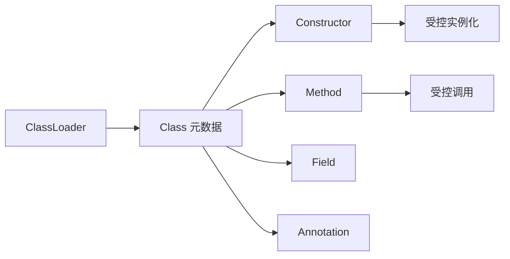

# Java 反射机制：Class、构造器、字段、方法、注解与动态代理

> 课件来源：《第9章 反射机制.pptx》。本文逐项覆盖课件目录，并依据 Java SE 26、JDK 25 LTS 及相关官方文档补充现代工程实践。

反射让程序在运行时检查和操作类型结构，是框架、序列化、依赖注入和测试工具的重要基础，也受到封装、模块和性能边界约束。

## 1. 学习目标

- 获得 Class 对象并检查类型结构。
- 通过 Constructor、Method、Field 安全调用成员。
- 理解注解、动态代理、MethodHandle 与模块访问。
- 替换课件中的过时 `Class.newInstance()` 用法。

## 2. 知识结构



## 3. 逐项详解

### 1. Class 对象与类元数据

每个已加载类型由一个 Class 对象表示，可通过类字面量、对象 getClass 或 Class.forName 获得。Class 同时携带名称、修饰符、父类、接口、组件类型、record/sealed 等结构信息。

**工程理解：** 类字面量类型安全且不触发字符串拼写错误；按名称加载适合插件和配置驱动场景。

**常见误区：** 认为同名类一定有同一个 Class；不同 ClassLoader 加载的同名类仍是不同类型。

### 2. 构造器实例化

使用 `getDeclaredConstructor(parameterTypes...).newInstance(args...)` 获取并调用构造器。调用会包装目标异常，需要处理 ReflectiveOperationException 与 InvocationTargetException。

**工程理解：** 优先显式工厂或 Supplier；反射实例化集中封装并验证允许类型。

**常见误区：** 继续使用已废弃的 `Class.newInstance()`，它要求无参构造且异常语义较差。

### 3. 获取接口、父类、构造器、方法与字段

`getXxx` 通常面向 public 且可含继承成员，`getDeclaredXxx` 面向当前类声明的全部可见性成员。反射数组返回顺序通常不应当作业务契约。

**工程理解：** 按名称与签名精确定位并缓存元数据；对框架扫描建立明确包边界。

**常见误区：** 依赖反射返回数组顺序，或把 inherited 与 declared 语义混淆。

### 4. Method 调用与参数

Method.invoke 的首参为接收者，static 方法可传 null；后续实参需兼容参数类型。目标方法抛出的异常封装在 InvocationTargetException cause 中。

**工程理解：** 框架边界做参数转换和异常解包，业务代码不应到处散落反射调用。

**常见误区：** 只记录 InvocationTargetException 而不查看 cause。

### 5. Field 访问与封装

Field 可读写实例或静态字段，但深反射受 Java 语言访问检查和 JPMS 模块开放规则约束。`setAccessible(true)` 不是跨模块无限通行证。

**工程理解：** 优先构造器、方法和标准序列化扩展点；需要模块反射时在 module-info 或启动参数中最小化 opens。

**常见误区：** 把突破 private 当正常业务 API，导致升级与安全边界脆弱。

### 6. 注解与保留策略

注解由 Target 限定位置、Retention 决定 SOURCE/CLASS/RUNTIME 可见性。运行时框架读取 RUNTIME 注解；编译期处理器读取源码/模型生成代码。

**工程理解：** 可在编译期解决的问题优先 annotation processor，减少运行时扫描和反射。

**常见误区：** 忘记 RUNTIME retention 后期待运行时反射读到注解。

### 7. 动态代理、MethodHandle 与性能

JDK Proxy 为接口生成代理，InvocationHandler 拦截调用；类代理通常借助字节码生成。MethodHandle 是更底层、可组合的调用能力，JIT 更容易优化，但 API 复杂。

**工程理解：** AOP、事务和 RPC 客户端可用代理实现，但必须理解 self-invocation、final 方法和异常传播限制。

**常见误区：** 认为代理等同于真实对象全部语义，或忽略 equals/hashCode/default method。

### 8. ClassLoader 与插件边界

类由“全限定名 + 定义它的 ClassLoader”共同标识。父级委派减少核心类重复，插件系统常建立隔离加载器并通过共享接口通信。

**工程理解：** 插件卸载要同时释放线程、ThreadLocal、缓存和对加载器的引用，否则产生 metaspace 泄漏。

**常见误区：** 只删除插件对象引用，却让全局缓存继续引用 Class 或 Method。

## 3.9 现代构造器调用

```java
Class<? extends Task> type = Class.forName(className).asSubclass(Task.class);
Task task = type.getDeclaredConstructor().newInstance();
```


## 4. 现代 Java 校准

- `Class.newInstance()` 已废弃，使用 `getDeclaredConstructor().newInstance()`。
- JPMS 强封装会限制深反射；框架升级要检查 `opens` 而不是长期堆叠 `--add-opens`。
- 高频路径可缓存反射元数据，但缓存要考虑 ClassLoader 生命周期。
- 代码生成、方法句柄或明确接口常比深反射更稳定。

## 5. 实践任务

1. 实现一个只允许白名单类型的注解驱动命令注册器。
2. 比较 getMethods 与 getDeclaredMethods 的返回差异。
3. 构造插件 ClassLoader 泄漏案例并用类卸载日志观察。

## 6. 掌握检查

- [ ] 能区分三种获得 Class 的方式及初始化副作用。
- [ ] 能正确解包反射调用异常。
- [ ] 能解释 public/declared、访问控制和 JPMS opens。
- [ ] 能说明 ClassLoader 身份和卸载条件。

## 参考资料

- [Core Reflection API](https://docs.oracle.com/en/java/javase/26/docs/api/java.base/java/lang/reflect/package-summary.html)
- [Class API](https://docs.oracle.com/en/java/javase/26/docs/api/java.base/java/lang/Class.html)
- [Java Language Specification 26](https://docs.oracle.com/javase/specs/jls/se26/html/)
