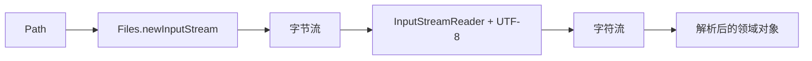

# Java I/O 与 NIO.2：文件、字节流、字符流、转换流与序列化

> 课件来源：《第10章 IO.pptx》。本文逐项覆盖课件目录，并依据 Java SE 26、JDK 25 LTS 及相关官方文档补充现代工程实践。

本章覆盖 File、目录遍历删除、字节/字符流、转换流、复制和对象序列化，并补充 Path/Files、缓冲、字符集、原子写入与反序列化防护。

## 1. 学习目标

- 区分路径模型、字节流与字符流。
- 正确使用缓冲、Charset 和 try-with-resources。
- 实现安全遍历、复制、原子替换与大文件处理。
- 理解 Java 原生序列化的兼容与安全风险。

## 2. 知识结构



## 3. 逐项详解

### 1. File 与 Path/Files

File 是旧式路径抽象；现代 NIO.2 使用 Path 表示路径、Files 执行检查和 I/O。路径可为相对或绝对，normalize 只做语法化简，toRealPath 才解析实际文件系统和符号链接。

**工程理解：** 安全边界先解析允许根目录，再检查最终路径仍位于根内；对符号链接策略做明确选择。

**常见误区：** 只做字符串前缀检查防目录穿越，或认为 normalize 等同于真实路径。

### 2. 文件属性、创建、删除与目录遍历

Files 可读取 BasicFileAttributes、创建目录/临时文件、删除与移动。目录非空时不能直接删除；walkFileTree 支持访问前后回调和失败处理。

**工程理解：** 递归操作处理权限错误、符号链接循环、并发变化和部分完成，记录可恢复进度。

**常见误区：** 把 `listFiles()` 的 null 或遍历中途异常当作空目录。

### 3. 字节流

InputStream/OutputStream 处理原始字节；read 返回实际读取数，-1 表示 EOF。单次 read 不保证填满缓冲区，write 后还要按所有权 flush/close。

**工程理解：** 图片、压缩包和协议帧按字节处理；使用缓冲或 transferTo/copy 提升吞吐。

**常见误区：** 忽略 read 返回值或用 available 判断文件剩余总长度。

### 4. 字符流与字符集

Reader/Writer 处理字符；InputStreamReader/OutputStreamWriter 在字节和字符间按 Charset 转换。UTF-8 应显式指定，解码错误策略需依据数据契约设置。

**工程理解：** 文本边界统一 UTF-8；内部使用 String/char/code point；协议必须声明编码。

**常见误区：** 依赖平台默认编码，导致 Windows、Linux 或容器结果不同。

### 5. 缓冲、复制与大文件

BufferedInputStream/Reader 减少系统调用；Files.copy、InputStream.transferTo 可表达常见复制。`readAllBytes`/`readString` 会一次载入内存，不适合不受控大文件。

**工程理解：** 根据文件上限选择流式处理；计算摘要、压缩、上传时保持 backpressure 和大小限制。

**常见误区：** 对用户上传直接 readAllBytes，造成内存峰值或 OOM。

### 6. 原子写入与文件一致性

可靠更新通常先在同目录写临时文件、flush/必要时 fsync，再使用 ATOMIC_MOVE 替换；是否支持原子移动取决于文件系统。

**工程理解：** 设计崩溃恢复与旧版本保留，捕获 AtomicMoveNotSupportedException 并明确降级语义。

**常见误区：** 直接覆盖唯一配置文件，进程中断后留下半写内容。

### 7. 对象序列化与 serialVersionUID

ObjectOutputStream/ObjectInputStream 把 Serializable 对象图编码为 Java 专用格式；serialVersionUID 参与版本兼容判断，transient 排除字段。构造器和不变量恢复语义复杂。

**工程理解：** 跨服务和长期存储优先 JSON/CBOR/Protobuf 等显式 schema；原生序列化仅限受控内部场景。

**常见误区：** 反序列化不可信字节，可能触发 gadget 链和资源消耗攻击。

### 8. 序列化过滤与边界防护

ObjectInputFilter 可限制允许类、对象深度、数组长度和引用数量，但并不能把任意不可信序列化自动变安全。

**工程理解：** 若遗留协议必须使用，配置严格白名单、大小/深度限制和隔离层，并计划迁移。

**常见误区：** 仅依赖 serialVersionUID 或签名字段判断输入安全。

## 3.9 UTF-8 流式读取

```java
try (var reader = Files.newBufferedReader(path, StandardCharsets.UTF_8)) {
    for (String line; (line = reader.readLine()) != null; ) {
        process(line);
    }
}
```


## 4. 现代 Java 校准

- 新代码优先 Path/Files，File 用于兼容旧 API。
- 文本始终显式 Charset，避免平台默认编码。
- 原生 Java 序列化不是通用跨服务格式；不可信数据边界避免使用。
- 递归删除和移动必须定义符号链接、失败恢复和根目录约束。

## 5. 实践任务

1. 实现限定根目录的文件浏览、复制和删除工具并测试目录穿越。
2. 用流式方式处理大日志，比较 readAllLines 的内存行为。
3. 实现临时文件 + 原子替换的配置保存流程。

## 6. 掌握检查

- [ ] 能区分字节流、字符流和转换流。
- [ ] 能解释一次 read 为什么可能少于缓冲区长度。
- [ ] 能设计安全的路径解析和原子写入。
- [ ] 能说明 Java 原生序列化的兼容与安全限制。

## 参考资料

- [Java NIO File API](https://docs.oracle.com/en/java/javase/26/docs/api/java.base/java/nio/file/package-summary.html)
- [Java I/O API](https://docs.oracle.com/en/java/javase/26/docs/api/java.base/java/io/package-summary.html)
- [Serialization Filtering](https://docs.oracle.com/en/java/javase/26/core/serialization-filtering1.html)
