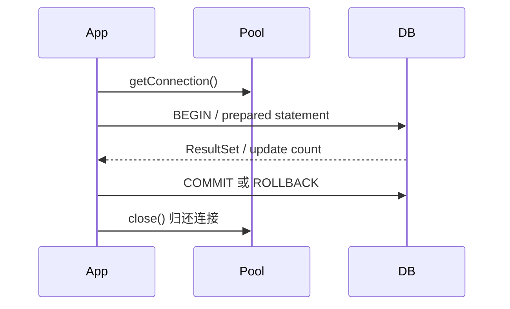

# JDBC 数据库访问：驱动、连接、Statement、事务、批处理与连接池

> 课件来源：《第11章 JDBC.pptx》。本文逐项覆盖课件目录，并依据 Java SE 26、JDK 25 LTS 及相关官方文档补充现代工程实践。

JDBC 是 Java 关系数据库访问的标准 API。课件的“加载驱动—连接—执行—处理结果—关闭”流程需要用 PreparedStatement、事务、连接池和异常边界现代化。

## 1. 学习目标

- 理解 JDBC 驱动、URL、Connection、Statement 与 ResultSet。
- 使用 PreparedStatement 防注入并正确绑定类型。
- 控制事务、隔离、批处理和资源释放。
- 理解连接池、超时、fetch size 与可观测性。

## 2. 知识结构



## 3. 逐项详解

### 1. JDBC 架构与驱动

`java.sql` 定义统一接口，数据库厂商驱动实现协议。现代 JDBC 4 驱动通过 service provider 自动注册，通常无需手写 `Class.forName`；连接 URL、属性和驱动版本必须匹配服务端。

**工程理解：** 驱动作为构建依赖锁版本，凭据来自安全配置，不写入源码。

**常见误区：** 复制 jar 到任意目录，或把 Class.forName 当成每次查询都要做的动作。

### 2. Connection 与资源所有权

Connection 表示数据库会话和事务上下文；Statement/ResultSet 隶属于连接。所有对象按逆序关闭，连接池场景的 close 通常是归还池而非物理断开。

**工程理解：** try-with-resources 明确作用域；事务方法内不要把 ResultSet 暴露到连接关闭后。

**常见误区：** 把单个 Connection 放进 static 跨线程共享。

### 3. Statement、PreparedStatement 与 SQL 注入

PreparedStatement 将 SQL 结构与值参数分离，驱动按类型绑定，避免值位置的 SQL 注入并利于复用。表名、列名和排序方向不能用 `?` 参数化，必须来自白名单。

**工程理解：** 所有外部值使用绑定参数；动态标识符映射到代码内枚举。

**常见误区：** 字符串拼接用户输入，或错误认为对单引号转义就覆盖全部注入风险。

### 4. ResultSet 与类型映射

ResultSet 游标初始位于第一行之前，调用 next 前进；按列名读取更可维护。SQL NULL 与 Java 基本类型默认值需通过包装类型、wasNull 或 getObject(Class) 区分。

**工程理解：** 集中 row mapper，显式处理时区、Decimal、枚举和 null。

**常见误区：** 读取 int 得到 0 后无法区分数据库 NULL 与真实 0。

### 5. 事务与隔离级别

关闭 autoCommit 后，同一 Connection 上的操作直到 commit/rollback 形成事务。隔离级别处理脏读、不可重复读和幻读，但数据库实现和 MVCC 细节不同。

**工程理解：** 事务围绕业务不变量保持短小；异常时 rollback，finally 恢复池所需连接状态。

**常见误区：** 跨远程调用长时间持有数据库事务，或忘记 rollback 让连接回池时状态污染。

### 6. 批处理、生成键与大结果集

`addBatch/executeBatch` 减少往返；`RETURN_GENERATED_KEYS` 读取生成主键。大结果集需要驱动相关 fetch size、流式游标和事务设置。

**工程理解：** 批量大小通过压测确定，处理部分失败和重复执行；分页优先稳定 keyset。

**常见误区：** 把百万行全部读入 List，或忽略批处理部分成功语义。

### 7. 连接池、超时与泄漏检测

连接建立昂贵，生产使用 HikariCP 等连接池。连接超时、查询超时、socket 超时和事务超时是不同层次；池大小受数据库容量和请求模型约束。

**工程理解：** 监控 active/idle/pending、获取等待、查询耗时和泄漏；池越大不一定吞吐越高。

**常见误区：** 只调大连接池掩盖慢 SQL，最终让数据库上下文切换更严重。

### 8. DAO 边界与 ORM 关系

JDBC 提供最底层可控能力，MyBatis/JPA 在其上减少映射样板，但事务、连接池和 SQL 性能仍回到 JDBC/数据库语义。

**工程理解：** 关键 SQL 保持可见、可测试、可解释；框架抽象不能替代 EXPLAIN 和事务设计。

**常见误区：** 使用 ORM 后不再理解数据库连接、事务和 N+1。

## 3.9 安全查询与事务

```java
try (Connection c = dataSource.getConnection()) {
    c.setAutoCommit(false);
    try (PreparedStatement ps = c.prepareStatement(
            "update account set balance = balance - ? where id = ?")) {
        ps.setBigDecimal(1, amount);
        ps.setLong(2, accountId);
        if (ps.executeUpdate() != 1) throw new SQLException("账户不存在");
        c.commit();
    } catch (Exception e) {
        c.rollback();
        throw e;
    }
}
```


## 4. 现代 Java 校准

- JDBC 4 驱动通常自动注册，Class.forName 主要用于遗留兼容。
- 值参数用 PreparedStatement；动态表/列名使用代码白名单。
- 生产连接来自 DataSource/连接池，事务连接不可跨线程共享。
- H2 与目标数据库行为有差异，关键集成测试使用 Testcontainers 运行真实数据库。

## 5. 实践任务

1. 实现转账事务，测试余额不足、并发更新和中途异常回滚。
2. 比较 offset 分页与 keyset 分页的执行计划。
3. 用 Testcontainers 运行 MySQL/PostgreSQL 集成测试并检查连接泄漏。

## 6. 掌握检查

- [ ] 能完整解释 JDBC 调用链和资源关闭顺序。
- [ ] 能防止值注入和动态标识符注入。
- [ ] 能设计事务与隔离级别测试。
- [ ] 能解释连接池大小和四类超时。

## 参考资料

- [JDBC API](https://docs.oracle.com/en/java/javase/26/docs/api/java.sql/module-summary.html)
- [JDBC Basics](https://docs.oracle.com/javase/tutorial/jdbc/basics/)
- [HikariCP](https://github.com/brettwooldridge/HikariCP)
- [Testcontainers JDBC](https://java.testcontainers.org/modules/databases/jdbc/)
