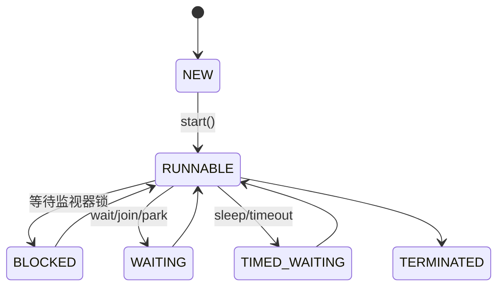

# Java 并发与多线程：生命周期、同步、锁、线程池、虚拟线程与取消

> 课件来源：《第12章 多线程.pptx》。本文逐项覆盖课件目录，并依据 Java SE 26、JDK 25 LTS 及相关官方文档补充现代工程实践。

本章覆盖进程/线程、Thread/Runnable/Callable、FutureTask、后台线程、状态、优先级、sleep/join/yield/interrupt、同步、死锁和 ReentrantLock，并扩展到 JMM、Executor、CompletableFuture 与虚拟线程。

## 1. 学习目标

- 理解线程状态、调度不确定性和 Java Memory Model。
- 使用正确的任务抽象、同步原语与取消协议。
- 识别竞态、可见性、原子性、死锁和资源耗尽。
- 选择平台线程池、虚拟线程或异步 API。

## 2. 知识结构



## 3. 逐项详解

### 1. 进程、平台线程与虚拟线程

进程拥有独立地址空间；线程共享进程资源但有各自栈。平台线程通常映射 OS 线程，虚拟线程由 JVM 调度，适合大量阻塞 I/O 任务，不会让 CPU 密集计算自动变快。

**工程理解：** 先识别 CPU-bound 与 blocking I/O；虚拟线程仍需限制下游连接、速率和内存资源。

**常见误区：** 把“百万虚拟线程”理解为数据库也能承受百万并发请求。

### 2. Thread、Runnable、Callable 与 Future

Thread 是执行载体；Runnable 无返回值；Callable 可返回值并抛受检异常；Future 表示异步结果与取消。继承 Thread 会把任务与线程机制耦合。

**工程理解：** 业务任务实现 Callable/Runnable，由 Executor 管理执行；直接 new Thread 仅用于小型受控场景。

**常见误区：** 在线上请求中无限创建平台线程，或调用 run 误以为启动了新线程。

### 3. 线程状态与调度方法

Thread.State 包含 NEW、RUNNABLE、BLOCKED、WAITING、TIMED_WAITING、TERMINATED。sleep 进入定时等待但不释放锁，join 等待目标结束，yield 只是调度提示，优先级不提供可靠业务顺序。

**工程理解：** 用同步原语表达先后关系，不靠 sleep、yield 或 priority“碰运气”。

**常见误区：** 把 Java RUNNABLE 等同于正在占用 CPU，或用 sleep 修复竞态。

### 4. 中断与协作式取消

interrupt 设置中断状态，阻塞方法可能抛 InterruptedException 并清除状态。任务应尽快响应取消；无法处理时恢复中断 `Thread.currentThread().interrupt()` 并退出。

**工程理解：** 循环检查 interrupted，关闭/取消下游资源，定义幂等停止流程。

**常见误区：** 捕获 InterruptedException 后吞掉，导致线程池无法及时关闭。

### 5. 竞态、可见性、原子性与 happens-before

多个线程无同步访问共享可变状态会产生数据竞争。volatile 提供可见性和特定顺序保证，但 `count++` 仍不是原子。锁、volatile、线程启动/结束和并发容器建立 happens-before 关系。

**工程理解：** 优先不可变数据、线程封闭和消息传递；共享状态使用锁或原子 API。

**常见误区：** 认为 volatile 等同于锁，或以单次测试没有失败证明线程安全。

### 6. synchronized、wait/notify 与条件队列

synchronized 同时提供互斥与内存可见性；实例同步锁 this，static 同步锁 Class。wait 必须在持锁时调用、会释放锁，并应在 while 条件循环中等待；notify 只唤醒一个等待者。

**工程理解：** 高层 BlockingQueue、CountDownLatch 等通常比手写 wait/notify 更安全。

**常见误区：** 用 if 代替 while 等待条件，忽略虚假唤醒和条件被其他线程再次改变。

### 7. ReentrantLock 与并发原语

ReentrantLock 支持可中断获取、超时尝试、公平策略和多个 Condition；必须在 finally unlock。Semaphore 控制并发许可，CountDownLatch 等待一次性事件，CyclicBarrier/Phaser 协调阶段。

**工程理解：** 只在需要额外能力时从 synchronized 升级到显式锁，并文档化锁顺序。

**常见误区：** 漏 unlock，或把公平锁当作免费且绝对公平。

### 8. 死锁、活锁与饥饿

死锁常满足互斥、持有并等待、不可剥夺和循环等待。固定锁顺序、减少嵌套、tryLock 超时可降低风险。活锁是线程不断响应却无进展，饥饿是长期得不到资源。

**工程理解：** 线程转储、JFR 和 jcmd 用于定位锁拥有者和等待链。

**常见误区：** 把所有“程序卡住”都叫死锁，忽略阻塞 I/O、线程池饥饿和外部依赖。

### 9. Executor、线程池与背压

ThreadPoolExecutor 由 core/max、队列、keepAlive、ThreadFactory 和拒绝策略组成。无界队列可能积压内存，有界队列配合拒绝/降级形成背压。

**工程理解：** CPU 池大小接近核数；阻塞池依据等待/计算比例但受下游容量约束；任务记录 trace 和等待时间。

**常见误区：** 使用 Executors.newFixedThreadPool 默认无界队列后忽略积压。

### 10. CompletableFuture 与结构化并发

CompletableFuture 组合异步阶段，但默认 commonPool 与异常链需谨慎。Structured Concurrency 在 JDK 26 仍为 preview，用词法作用域管理子任务生命周期、失败传播和取消。

**工程理解：** 生产默认依赖稳定 API；试用 preview 时隔离模块并准备迁移。

**常见误区：** 只组合成功路径，忽略 exceptionally/handle、超时和取消；把 preview 当稳定长期 API。

## 3.9 最小可运行示例

```java
try (var executor = Executors.newVirtualThreadPerTaskExecutor()) {
  List<Future<String>> futures = endpoints.stream()
      .map(uri -> executor.submit(() -> client.fetch(uri)))
      .toList();
  for (Future<String> future : futures) {
    System.out.println(future.get(2, TimeUnit.SECONDS));
  }
}
```

## 4. 现代 Java 校准

- 优先任务 + Executor，而不是业务类继承 Thread。
- 虚拟线程适合高并发阻塞 I/O，仍要对数据库、文件和远端服务做限流。
- Structured Concurrency 在 JDK 26 是第六次 preview，学习时必须标注实验状态。
- `Thread.stop/suspend/resume` 不属于可靠取消方案；使用 interrupt 和协作式清理。

## 5. 实践任务

1. 实现有界生产者消费者并验证背压、取消和关闭。
2. 分别用平台线程池和虚拟线程执行阻塞 HTTP 任务，测量吞吐与资源。
3. 制造锁顺序死锁，用 `jcmd Thread.print` 或 JFR 定位。

## 6. 掌握检查

- [ ] 能解释六种 Thread.State 和 RUNNABLE 的含义。
- [ ] 能区分 volatile、锁和原子类。
- [ ] 能设计中断、超时和线程池关闭流程。
- [ ] 能说明虚拟线程的优势与非目标。

## 参考资料

- [Thread API Java 26](https://docs.oracle.com/en/java/javase/26/docs/api/java.base/java/lang/Thread.html)
- [Java Concurrency Utilities](https://docs.oracle.com/en/java/javase/26/docs/api/java.base/java/util/concurrent/package-summary.html)
- [Java Virtual Threads Guide](https://docs.oracle.com/en/java/javase/26/core/virtual-threads.html)
- [JEP 525 Structured Concurrency](https://openjdk.org/jeps/525)
