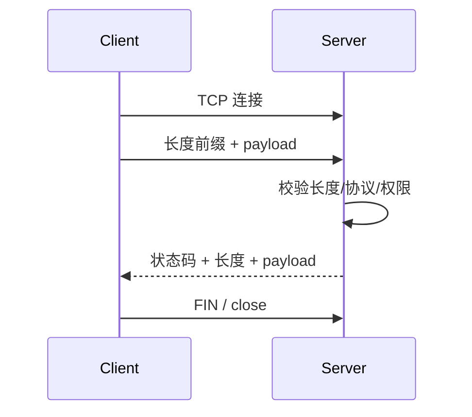

# Java 网络编程：TCP、UDP、IP、端口、Socket、URL 与 HTTP Client

> 课件来源：《第13章 网络编程.pptx》。本文逐项覆盖课件目录，并依据 Java SE 26、JDK 25 LTS 及相关官方文档补充现代工程实践。

本章覆盖网络协议、TCP/UDP、IP/端口、InetAddress、URL、ServerSocket/Socket、DatagramPacket/DatagramSocket 和多线程服务端，并补充协议分帧、超时、TLS 与 HTTP Client。

## 1. 学习目标

- 理解 DNS、IP、端口、TCP、UDP 和应用协议分层。
- 实现有超时、分帧和资源上限的 TCP/UDP 程序。
- 使用 URI/URL 与现代 HttpClient。
- 识别半包粘包、阻塞、重试和安全边界。

## 2. 知识结构

## 3. 逐项详解

### 1. 网络分层、地址与端口

IP 提供主机间寻址与分组传输，TCP/UDP 用端口区分主机上的通信端点，应用协议定义字节含义。DNS 将域名解析为地址，解析结果可能随时间和网络视图变化。

**工程理解：** 配置使用主机名和服务发现，日志同时记录逻辑服务、解析地址和 trace id。

**常见误区：** 把端口当进程永久身份，或缓存 DNS 结果而不考虑 TTL 与故障切换。

### 2. TCP 与 UDP

TCP 提供有序可靠字节流、拥塞控制和连接语义，但不保留消息边界；UDP 提供数据报，无连接、可能丢失/乱序/重复且有大小限制。

**工程理解：** 可靠性、顺序和重传由协议层决定；UDP 应用需自行定义消息 ID、重试或容错。

**常见误区：** 认为一次 TCP write 对应对端一次 read，导致半包/粘包错误。

### 3. InetAddress、URI 与 URL

InetAddress 表示 IP 地址和解析操作；URI 是标识符语法，URL 还能打开资源连接。构造 URI 时应按组件编码，不能简单字符串拼接用户输入。

**工程理解：** 服务端请求外部 URL 要防 SSRF，解析后限制 scheme、主机、最终地址和重定向。

**常见误区：** 只检查原始 URL 文本，忽略 DNS 重绑定、IPv6 和重定向。

### 4. ServerSocket 与 Socket

ServerSocket bind/listen/accept 返回连接 Socket；Socket 的 InputStream/OutputStream 表示双向字节流。读超时、连接超时、半关闭和 close 都有不同语义。

**工程理解：** 连接数、消息大小、空闲时间和处理并发都要有上限；每连接资源在 finally/try-with-resources 中释放。

**常见误区：** accept 后无限创建平台线程，或永远阻塞读取无终止协议的数据。

### 5. 应用层分帧

TCP 字节流需要长度前缀、分隔符、固定长度或自描述协议确定消息边界。长度字段必须校验非负与最大值，读取应循环直到满帧或 EOF。

**工程理解：** 协议定义版本、编码、长度、校验、错误码和幂等语义；先写解析器模糊测试。

**常见误区：** 信任远端声明的巨大长度并直接分配数组。

### 6. DatagramPacket 与 DatagramSocket

DatagramPacket 封装缓冲区、长度和地址；DatagramSocket 发送/接收数据报。接收缓冲区小于报文时数据可能截断。

**工程理解：** 限制报文大小，验证来源，加入请求 ID、防重和超时；需要可靠流时选择 TCP/QUIC 等。

**常见误区：** 假设 UDP send 成功等同于对端业务已处理。

### 7. 并发服务端与 NIO

传统阻塞模型可使用有界线程池或虚拟线程；NIO Selector 适合大量连接事件复用，但状态机和缓冲管理更复杂。Netty 在 NIO 之上提供事件循环与 pipeline。

**工程理解：** 根据连接量、处理模型和团队能力选择；先保证协议正确和背压，再追求事件驱动性能。

**常见误区：** 为普通业务过早手写 Selector，产生难测状态机和缓冲 bug。

### 8. HttpClient、TLS、超时与重试

JDK HttpClient 支持同步/异步、HTTP/1.1、HTTP/2，JDK 26 加入 HTTP/3。连接超时与请求超时需分别配置；TLS 必须验证证书和主机名。重试仅对幂等或带幂等键操作安全。

**工程理解：** 统一客户端封装连接池、超时、重试预算、限流、trace 与指标。

**常见误区：** 关闭证书校验解决环境问题，或对支付 POST 无条件重试。

## 4. 现代 Java 校准

- TCP 是字节流，不携带消息边界。
- 高并发阻塞 I/O 可先评估虚拟线程，事件循环适用于需要精细连接控制的场景。
- JDK 26 HttpClient 已支持 HTTP/3；生产采用前先验证代理、网关和观测链兼容。
- 网络边界必须设置连接、读取、总体截止时间和资源上限。

## 5. 实践任务

1. 实现长度前缀 TCP echo 协议，覆盖半包、超长、EOF 和超时。
2. 实现带请求 ID 与超时的 UDP 客户端，观察丢包/重复处理。
3. 用 HttpClient 调用测试服务，记录 DNS、连接、首字节和总耗时。

## 6. 掌握检查

- [ ] 能解释 TCP 与 UDP 的保证和非保证。
- [ ] 能设计可靠应用层分帧。
- [ ] 能区分连接超时、读取超时和总体截止时间。
- [ ] 能说明阻塞线程、虚拟线程与 NIO 事件循环的取舍。

## 参考资料

- [Java Networking Guide](https://docs.oracle.com/en/java/javase/26/core/java-networking.html)
- [HTTP Client API](https://docs.oracle.com/en/java/javase/26/docs/api/java.net.http/java/net/http/HttpClient.html)
- [JEP 517 HTTP/3](https://openjdk.org/jeps/517)
- [Java SE 26 API](https://docs.oracle.com/en/java/javase/26/docs/api/)
