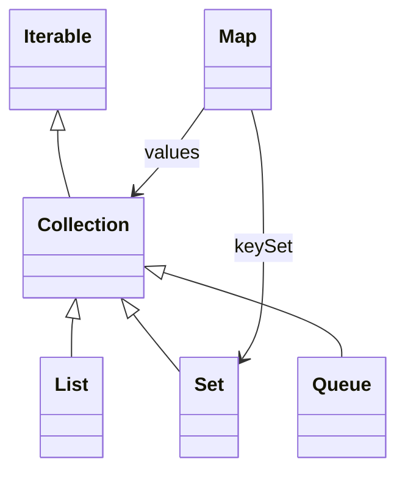

# 泛型与集合框架综合：类型安全容器、迭代、排序与集合选型

> 课件来源：《泛型与集合框架.pptx》（原文件为旧版 OLE 演示文稿）。本文逐项覆盖课件目录，并依据 Java SE 26、JDK 25 LTS 及相关官方文档补充现代工程实践。

该课件以类集框架结构为主。本综合章把 Collection、List、Set、Map、泛型、迭代器与排序连成一条可用于真实 API 设计的知识链，并作为第7、8章的复习与提升。

## 1. 学习目标

- 从集合语义反推接口和实现。
- 用泛型表达容器输入输出关系。
- 正确设计排序、相等与不可变边界。
- 完成一套类型安全的小型仓储 API。

## 2. 知识结构



## 3. 逐项详解

### 1. 类集框架整体结构

Iterable 提供迭代入口，Collection 下分 List/Set/Queue，Map 独立表达键值。AbstractXxx 骨架类帮助自定义实现，但业务通常组合标准集合而非继承具体集合。

**工程理解：** 声明接口、构造具体实现、边界返回不可修改副本，是最常用的三步。

**常见误区：** 继承 ArrayList 加业务字段，导致 equals、序列化和替换原则混乱。

### 2. 泛型容器 API

容器的类型参数应贯穿插入、查询和返回值；查询条件可用 Predicate<? super T>，转换可用 Function<? super T, ? extends R>。

**工程理解：** 用通配符增加输入灵活性，用明确 T/R 保留输出关系。

**常见误区：** 返回原始 List 或 Object，让调用者自行强转。

### 3. 唯一性、身份与相等

Set 和 Map key 的行为取决于 equals/hashCode 或 Comparator。领域实体的身份、值对象的属性相等和数据库主键不是所有生命周期阶段都相同。

**工程理解：** 在对象进入哈希容器前确定稳定相等策略；未持久化实体不要依赖后生成 ID 造成 hash 变化。

**常见误区：** 把可变数据库实体直接作为长期 Map key。

### 4. 排序与稳定性

Comparable 定义自然顺序，Comparator 定义外部可组合顺序；`thenComparing` 建立确定性 tie-breaker。排序集合的比较零值决定唯一性。

**工程理解：** 分页和持久结果必须有唯一稳定的最后排序键。

**常见误区：** 只按时间排序，时间相同导致翻页遗漏或重复。

### 5. 迭代、Stream 与惰性

Iterator 是有状态游标，Stream 是一次性惰性计算描述。两者都不自动复制底层数据；修改源集合可能破坏操作。

**工程理解：** 返回 Stream 时文档化资源和生命周期；数据库流必须在事务/连接有效期内关闭。

**常见误区：** 复用已经终止的 Stream，或返回依赖已关闭资源的 Stream。

### 6. 不可变边界与防御性复制

List.copyOf 产生不可修改副本，但元素对象仍可能可变。深度不可变需要元素本身不可变或逐层复制。

**工程理解：** 配置、事件和跨线程消息优先不可变值对象与不可修改集合。

**常见误区：** 只包一层 unmodifiableList 就宣称整个对象图线程安全。

### 7. 复杂度与实际性能

Big-O 描述规模趋势，不包含常数、缓存局部性、分配和 GC。ArrayList 顺序遍历常优于链表；哈希结构性能依赖良好散列和容量。

**工程理解：** 先依据语义选择，再用 JMH 在真实数据分布下测量热点。

**常见误区：** 只背复杂度表，不验证实际访问模式和内存成本。

## 3.8 类型安全仓储接口

```java
interface Repository<ID, T> {
    Optional<T> findById(ID id);
    List<T> findAll(Predicate<? super T> filter);
    T save(T entity);
}
```


## 4. 现代 Java 校准

- 集合公开 API 使用参数化类型，raw type 仅出现在必要的遗留适配层。
- JDK 21 的 Sequenced 系列统一了首尾与反向视图，但具体性能仍取决于实现。
- 返回集合时明确快照、视图、可变性和线程安全语义。
- 性能结论通过 JMH、分配分析和真实数据验证。

## 5. 实践任务

1. 实现内存 Repository<ID,T>，并为重复 ID、排序和并发访问写测试。
2. 用 Comparator 组合实现稳定多字段分页排序。
3. 比较视图、浅副本、深副本对后续修改的响应。

## 6. 掌握检查

- [ ] 能画出 Collection 与 Map 的核心结构。
- [ ] 能用泛型与通配符设计容器 API。
- [ ] 能保证相等、排序和分页稳定性。
- [ ] 能说明集合不可修改与对象图不可变的差异。

## 参考资料

- [Java Collections Framework](https://docs.oracle.com/en/java/javase/26/core/java-collections-framework.html)
- [Java Generics](https://dev.java/learn/generics/)
- [Java SE 26 API](https://docs.oracle.com/en/java/javase/26/docs/api/)
