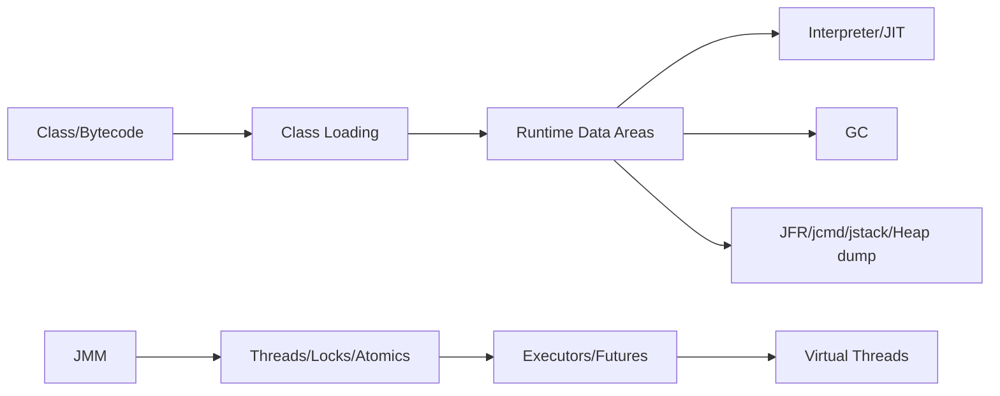

# JVM 与并发：从运行时到生产诊断

> **Freshness metadata**
> - `last_verified`: `2026-08-24`
> - `version_scope`: `JDK 25 baseline; JDK 26 feature awareness`
> - `source_type`: `JVMS + OpenJDK JEP + JDK docs`
> - `stability`: `version-sensitive`

## 学习问题

1. Java source 如何成为 class file，class loader 的 identity 为何包含 loader？
2. heap、thread stack、metaspace、code cache 各保存什么，OOM/StackOverflow 如何区分？
3. JIT 依据 profile 优化后为何可能 deoptimize？
4. GC 的 pause、throughput、latency 与 allocation rate 如何共同分析？
5. JMM 的 happens-before 如何约束可见性与排序？`volatile` 为什么不自动让复合操作原子？
6. platform thread、virtual thread、async API、reactive stream 分别是什么抽象？
7. 出现 CPU、停顿、死锁、内存增长时，选择 JFR、jcmd、jstack、heap dump 的依据是什么？

## 生产原则

先测量再调参。保留 JVM/JDK/container/GC flags、负载、warm-up、JFR 和 GC log。不要从一次 heap dump 推断长期趋势，也不要在未理解 workload 时复制“最佳 JVM 参数”。
