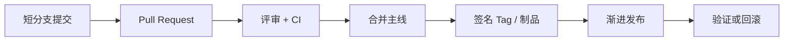

# Git 协作与版本治理：提交、分支、合并、变基、标签与发布

Git 的对象模型决定了提交、分支和回滚的真实语义；团队流程再在此基础上定义评审、CI 和发布。

## 1. 本文覆盖范围

- 工作区、暂存区、提交、树与引用
- branch、merge、rebase、cherry-pick 与 revert
- 远程跟踪、PR、代码评审与保护规则
- 版本号、tag、release 与紧急修复

## 2. 核心知识详解

### 1. 对象模型与三棵树

Git 提交指向目录树和父提交，分支只是可移动引用。工作区、index 和 HEAD 分别表示当前文件、下次提交快照和当前提交。

- `git status` 先判断状态，再选择 add/restore/reset/commit。
- 提交应是可构建、意图单一的逻辑变更，消息解释为什么。
- 大文件和密钥不进入历史；敏感泄露需要轮换凭据并清理历史。

**正确性边界：** `reset` 移动引用并可能改 index/工作区；`revert` 创建反向提交，更适合共享历史。

### 2. 合并与变基

merge 保留分叉并产生合并关系；rebase 重放提交形成线性历史，会改变提交 ID。二者都需要对冲突后的语义重新测试。

- 个人未共享分支可交互式 rebase 整理；公共稳定分支避免重写历史。
- 冲突解决不是“保留两边文本”，而是重建符合当前契约的代码。
- 合并后运行测试、静态检查和迁移验证。

**正确性边界：** rebase 后内容可能相同但提交身份不同；已被他人基于的历史需谨慎重写。

### 3. 分支与评审策略

Trunk-based 强调短分支和频繁集成；Git Flow 强调 release/hotfix 分支。选择取决于发布节奏、自动化和合规要求。

- 主分支保护、必需检查、至少一名评审者和禁止直接推送。
- PR 保持小而可理解，描述验证证据和风险。
- 功能未完成用 feature flag 隔离，而非长期分支。

**正确性边界：** 分支模型本身不产生质量；自动化测试、评审和可回滚发布才构成控制闭环。

### 4. 标签、语义版本与发布

annotated tag 可签名并携带发布信息。语义版本用 MAJOR/MINOR/PATCH 表达兼容承诺，但内部服务仍需明确 API、数据库和事件 schema 的兼容策略。

- 制品只构建一次，多环境提升同一个制品。
- 发布记录 commit/tag、依赖、迁移、配置和回滚步骤。
- hotfix 从生产基线修复，并回合主线避免分叉。

**正确性边界：** 删除或移动发布 tag 会破坏可追溯性；正式 tag 应视为不可变。

## 3. 工程链路

## 4. 实践与验证

1. 在临时仓库制造 merge/rebase 冲突，比较提交图。
2. 设计主分支保护和 Conventional Commits/版本发布规则。
3. 演练一次数据库迁移发布失败后的代码与数据回滚。

## 5. 掌握检查

- [ ] 能解释 HEAD、index、branch 与 commit。
- [ ] 能选择 revert、reset、rebase 和 merge。
- [ ] 能设计短分支、必需检查和可追溯发布。
- [ ] 能证明线上制品对应哪个 commit。

## 参考资料

- [Pro Git](https://git-scm.com/book/zh/v2)
- [Git Reference](https://git-scm.com/docs)
- [Semantic Versioning](https://semver.org/)
