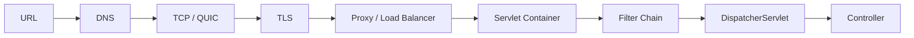

# Internet 心智模型：从 URL 到 Spring Controller

> **Freshness metadata**
> - `last_verified`: `2026-08-24`
> - `version_scope`: `HTTP semantics and backend fundamentals`
> - `source_type`: `RFC + official platform docs`
> - `stability`: `stable-concept`

## 1. 一次请求

浏览器解析 scheme/host/port/path；DNS 将 host 解析为地址；连接可能经 TCP+TLS（HTTP/1.1、HTTP/2）或 QUIC+TLS（HTTP/3）；代理/负载均衡器选择实例；容器解析 HTTP 并分派线程/请求；Filter 处理安全与横切逻辑；Spring MVC 映射 Controller、参数转换、validation、service 与 response。

## 2. HTTP semantics

方法、状态码、header、representation、cache、conditional request 和 idempotency 是 API 契约。`GET` 应安全；`PUT` 语义上幂等；`POST` 是否可重试取决于应用提供的 idempotency key。keep-alive 复用连接，不等同于 WebSocket。

## 3. Proxy、cookie 与 CORS

- forward proxy 代表客户端；reverse proxy 代表服务端；load balancer 是路由/分配职责，不自动解决应用状态。
- Cookie 由浏览器按 domain/path/SameSite/Secure/HttpOnly 规则发送；server-side session 与 cookie 不是同一对象。
- CORS 是浏览器对跨源脚本请求的策略；它不是服务端认证，也不阻止非浏览器客户端。

## 4. 诊断顺序

DNS→连接→TLS→HTTP status/headers→proxy route→container/filter→controller→DB/downstream。使用 `curl -v`、DNS 工具、证书检查、access log、trace/span 和应用日志关联 request id，避免把所有超时归因于 Controller。
