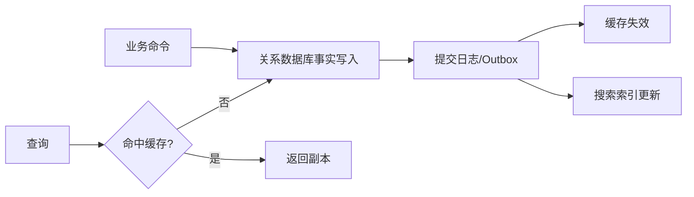

# 数据库、缓存与搜索：从零开始的阶段导学

> 这一页是本阶段的入口，不假设读者已经接触过对应框架。先建立“为什么需要它、它在链路中的位置、如何验证”的心智模型，再进入各专题。

## 1. 本阶段解决什么问题

学习数据如何持久保存、并发修改、按条件检索与加速访问。关系数据库是事实来源的常见选择；Redis 适合低延迟数据结构和协调场景；Elasticsearch 面向全文检索。三者的数据模型、一致性保证和失败语义不同。

### 前置知识

- 会使用集合表达一组对象
- 理解请求可能并发到达且服务可能中途失败

## 2. 零基础词汇与心智模型

### 1. 表、行与约束

表描述关系；主键标识行，外键、唯一、非空和检查约束把业务不变量放到最终写入边界。

**学会的证据：** 能用 DDL 表达“订单号唯一且金额非负”。

### 2. 事务

事务把多个读写组织成一个原子单位。ACID 分别描述原子性、一致性、隔离性和持久性；隔离级别决定并发可见性，不等同于业务正确性。

**学会的证据：** 能复现丢失更新并用锁或版本号修正。

### 3. 索引

索引以额外空间和写放大换取查询路径。联合索引是否有效取决于谓词、排序、选择性和实际执行计划。

**学会的证据：** 能用 EXPLAIN 验证，而非仅凭“最左前缀”口诀。

### 4. 缓存

缓存保存派生副本，命中时更快，失效时必须回到事实来源。过期、淘汰、穿透、击穿和一致性都需要明确策略。

**学会的证据：** 能解释 cache-aside 的读写时序与短暂不一致窗口。

### 5. 倒排索引

全文搜索把词项映射到文档集合，适合相关性、分词、聚合与模糊检索；它通常不是强事务事实库。

**学会的证据：** 能设计数据库到搜索索引的可重放同步链路。

## 3. 建议学习顺序

1. SQL 与数据建模
2. 事务、锁、MVCC 与索引执行计划
3. Redis 数据结构与缓存模式
4. 全文搜索、映射、分析器与同步

## 4. 完整链路



## 5. 最小代码切片

```sql
BEGIN;
UPDATE inventory SET stock = stock - 1
WHERE sku_id = 42 AND stock > 0;
COMMIT;
```

## 6. 第一个可验证练习

实现商品查询：数据库保存商品事实，Redis 采用 cache-aside，更新时先提交数据库再失效缓存。记录一次并发更新和一次缓存失效失败，说明系统会看到什么以及如何补偿。

## 7. 初学者容易混淆的边界

- 给每列建索引会增加写成本且未必帮助查询
- Redis 单条命令原子不代表跨系统事务原子
- 搜索索引刷新成功时间与数据库提交时间通常不同

## 8. 阶段验收

- [ ] 能读基础执行计划
- [ ] 能说明隔离级别和锁的边界
- [ ] 能为缓存与搜索同步设计失败恢复

## 参考资料

- [PostgreSQL Tutorial](https://www.postgresql.org/docs/current/tutorial.html)
- [MySQL Reference Manual](https://dev.mysql.com/doc/refman/8.4/en/)
- [Redis Documentation](https://redis.io/docs/latest/)
- [Elasticsearch Reference](https://www.elastic.co/guide/en/elasticsearch/reference/current/index.html)
