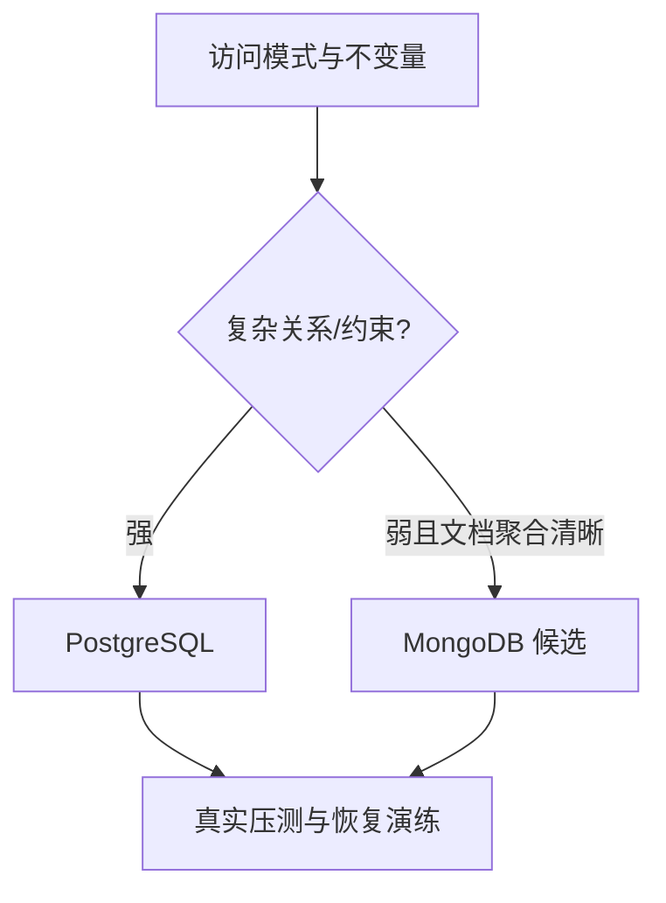

# PostgreSQL 与 MongoDB：选修数据库的模型与选型

PostgreSQL 仍是关系数据库，MongoDB 是文档数据库；选型应从事务边界、查询和数据演进出发，而不是用“SQL/NoSQL”二分法。

## 1. 本文覆盖范围

- PostgreSQL MVCC、类型、索引、JSONB 与扩展
- MongoDB 文档、集合、索引、聚合与事务
- 嵌入/引用、范式/反范式和一致性
- Java 驱动与 Spring Data 边界

## 2. 核心知识详解

### 1. PostgreSQL 能力模型

PostgreSQL 提供强类型、事务、丰富索引、窗口函数、CTE、JSONB、全文检索和扩展。其 MVCC 与 vacuum 机制决定长事务和表膨胀运维特点。

- EXPLAIN (ANALYZE, BUFFERS) 观察实际执行与缓存命中。
- GIN/GiST/BRIN 等索引服务不同数据和查询模式。
- 连接仍是有限资源，使用连接池并避免长事务。

**正确性边界：** JSONB 提供灵活性但不会自动替代关系约束；高频查询字段仍需稳定 schema 和索引。

### 2. MongoDB 文档模型

MongoDB 以 BSON 文档存储，单文档更新天然原子；嵌入适合一起读取和更新的有界聚合，引用适合独立生命周期或无界多对多。

- schema validation、唯一索引和应用校验共同保护数据。
- 聚合 pipeline 做变换与汇总，索引依据过滤和排序设计。
- 副本集写关注和读关注决定持久性与一致性。

**正确性边界：** “无 schema”实际是 schema-on-read/应用维护 schema，并不等于没有数据契约。

### 3. 事务与分布

PostgreSQL 和 MongoDB 都支持事务，但跨文档/分片事务成本更高。数据模型应尽量让强一致更新落在自然事务边界内。

- 识别 read-your-writes、单调读和最终一致需求。
- 跨服务不使用数据库事务假装本地调用，采用事件/补偿等模式。
- 故障切换时测试客户端重试与幂等。

**正确性边界：** 支持事务不代表应该把任意跨聚合流程塞进长事务。

### 4. 选型矩阵

关系完整性、复杂 JOIN 和强 SQL 分析通常偏 PostgreSQL；聚合文档、字段演进与按文档访问可考虑 MongoDB。团队运维、备份恢复和监控能力同样是约束。

- 用真实数据规模、查询和故障场景做原型。
- 评估二级索引、分片键、热点、恢复目标和成本。
- 避免一个系统同时引入过多数据产品。

**正确性边界：** 数据库选择是整体工作负载决策，不应根据单个功能或宣传标签。

## 3. 工程链路

## 4. 实践与验证

1. 用同一订单域分别做关系模型和文档模型，比较更新原子性。
2. 在 PostgreSQL JSONB 和 MongoDB 上实现同一查询并比较索引。
3. 演练副本故障下的客户端重试与重复写防护。

## 5. 掌握检查

- [ ] 能解释 PostgreSQL MVCC/vacuum。
- [ ] 能选择 MongoDB 嵌入或引用。
- [ ] 能基于事务和查询模式选型。
- [ ] 能给出备份恢复和故障切换证据。

## 参考资料

- [PostgreSQL Documentation](https://www.postgresql.org/docs/current/)
- [MongoDB Data Modeling](https://www.mongodb.com/docs/manual/data-modeling/)
- [MongoDB Transactions](https://www.mongodb.com/docs/manual/core/transactions/)
