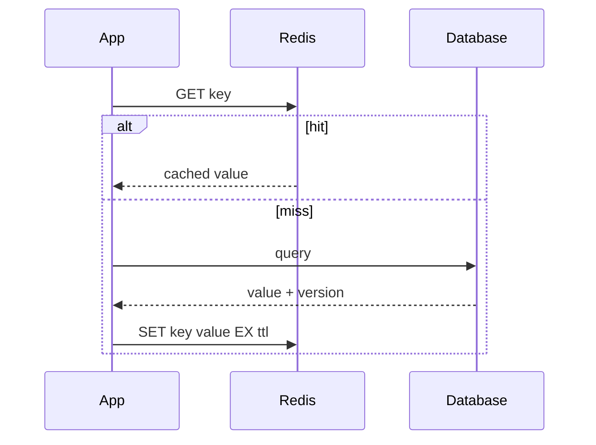

# Redis 与缓存工程：数据类型、持久化、高可用、集群与一致性

Redis 不只是缓存；正确使用要理解数据类型、过期/淘汰、RDB/AOF、复制、Sentinel、Cluster 和缓存一致性。

## 1. 本文覆盖范围

- String/Hash/List/Set/ZSet/Stream/Bitmap/HyperLogLog/Geo
- TTL、内存淘汰、RDB、AOF 与恢复
- 主从复制、Sentinel、Cluster 与热 key
- 缓存穿透、击穿、雪崩、双写一致性和分布式锁

## 2. 核心知识详解

### 1. 数据类型与命令复杂度

Redis 是数据结构服务器。String 可做计数和二进制值，Hash 表示小对象，List/Stream 服务队列语义，Set/ZSet 服务唯一集合和排序，概率结构换空间。

- 每个 key 设计命名、类型、最大基数、TTL 和所有者。
- 避免 O(n) 大命令阻塞事件循环，使用 SCAN 和分批操作。
- 大 key、热 key 和高基数指标都需监控。

**正确性边界：** 单条命令原子不等于由多条命令组成的业务流程原子。

### 2. 过期、淘汰与内存

TTL 是逻辑过期，删除由惰性与定期策略执行；maxmemory-policy 决定内存满时淘汰。内存还包含对象、字典、复制缓冲和碎片。

- TTL 加随机抖动避免同一时刻大量失效。
- 缓存 value 设大小上限，压缩需权衡 CPU。
- 观察 used_memory、RSS、fragmentation、evicted_keys。

**正确性边界：** 设置 TTL 不保证到点立即释放内存；业务不得依赖物理删除时间。

### 3. RDB、AOF 与高可用

RDB 是时间点快照，恢复快但可能丢快照间数据；AOF 记录写命令并按刷盘策略权衡持久性。复制异步，Sentinel 负责监控/选主，Cluster 按 slot 分片。

- 缓存与数据源明确谁是事实来源。
- 持久 Redis 也要备份、恢复演练和容量规划。
- 故障切换窗口可能出现已确认写丢失，按业务接受度设计。

**正确性边界：** Redis 复制默认异步，高可用不等同于零数据丢失。

### 4. 缓存模式与一致性

Cache-aside 由应用读缓存、miss 查库回填，写库后失效缓存。并发下存在旧值回填和双写窗口，需要版本、延迟双删、消息失效或 CDC 等策略。

- 缓存穿透用校验/空值/Bloom，击穿用互斥或逻辑过期，雪崩用抖动和降级。
- 回填前后检查版本，防慢请求覆盖新值。
- 缓存失败时定义 fail-open/fail-closed 和数据库保护。

**正确性边界：** 任何“先库后缓存/先缓存后库”的简单顺序都存在并发窗口，需按一致性要求量化。

### 5. 分布式锁与队列边界

单实例 `SET key value NX PX ttl` 配合唯一 token 和 Lua 校验删除可做租约，但进程暂停和 TTL 到期可能导致多个持有者。严格互斥需要 fencing token 和受保护资源校验。

- 锁必须有超时、唯一 owner、原子释放和业务幂等。
- 延迟队列/消息队列需求优先评估专用系统与 Redis Streams。
- 不要用 KEYS 扫全库实现业务调度。

**正确性边界：** 锁客户端认为“仍持有”并不证明租约未过期；最终资源必须拒绝旧 fencing token。

## 3. 工程链路

## 4. 实践与验证

1. 实现带版本的 cache-aside，制造慢回填覆盖新值并修复。
2. 压测热 key、大 key 和批量删除，观察延迟长尾。
3. 演练 Redis 主节点故障与缓存全失效时的数据库保护。

## 5. 掌握检查

- [ ] 能按业务语义选择 Redis 数据类型。
- [ ] 能区分 TTL、淘汰和持久化。
- [ ] 能解释复制故障切换的数据窗口。
- [ ] 能设计穿透、击穿、雪崩和双写一致性方案。

## 参考资料

- [Redis Data Types](https://redis.io/docs/latest/develop/data-types/)
- [Redis Persistence](https://redis.io/docs/latest/operate/oss_and_stack/management/persistence/)
- [Redis Replication](https://redis.io/docs/latest/operate/oss_and_stack/management/replication/)
- [Redis Cluster](https://redis.io/docs/latest/operate/oss_and_stack/reference/cluster-spec/)
