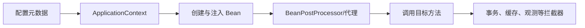

# Spring Framework：从零开始的阶段导学

> 这一页是本阶段的入口，不假设读者已经接触过对应框架。先建立“为什么需要它、它在链路中的位置、如何验证”的心智模型，再进入各专题。

## 1. 本阶段解决什么问题

理解 Spring 如何创建对象、连接依赖、在方法调用边界织入事务等基础设施，并通过事件、资源、校验、缓存和调度支持应用。重点是容器与代理的真实边界，而不是背注解。

### 前置知识

- 熟悉接口、继承、注解、反射与异常
- 会用 JDBC 完成事务

## 2. 零基础词汇与心智模型

### 1. IoC 容器

容器读取配置并创建、装配和管理对象。依赖注入是 IoC 的一种实现，使对象通过构造器声明需要的协作者。

**学会的证据：** 能用纯 Java 配置装配两个组件并写替身测试。

### 2. Bean 生命周期

Bean 从定义、实例化、依赖注入、初始化回调到销毁回调经历多个阶段；作用域决定实例共享边界。

**学会的证据：** 能解释 singleton Bean 为何不应保存请求可变状态。

### 3. 代理与 AOP

Spring 常用代理包裹目标对象，在调用前后执行横切逻辑。只有经过代理的调用才会被拦截。

**学会的证据：** 能复现同类自调用导致事务注解未生效。

### 4. 声明式事务

事务拦截器依据传播、隔离、只读和回滚规则控制底层资源事务。数据库事务不会自动覆盖远程调用。

**学会的证据：** 能划分短事务边界并说明异常回滚规则。

## 3. 建议学习顺序

1. 先手写对象装配，再学习容器与构造器注入
2. 理解 Bean 定义和生命周期
3. 观察代理对象与真实对象
4. 最后学习事务、事件、缓存和调度

## 4. 完整链路



## 5. 最小代码切片

```java
@Service
final class OrderService {
  private final OrderRepository repository;
  OrderService(OrderRepository repository) { this.repository = repository; }
}
```

## 6. 第一个可验证练习

实现 `OrderService` 与内存 `OrderRepository`，先手工构造，再交给 Spring；加入事务方法与同类自调用，对比代理类型、日志与数据库提交结果。

## 7. 初学者容易混淆的边界

- 依赖注入不是服务定位器
- AOP 代理不是修改了目标类源码
- 声明式事务不跨线程自动传播

## 8. 阶段验收

- [ ] 能画出 Bean 生命周期
- [ ] 能解释 JDK/CGLIB 代理选择
- [ ] 能定位事务注解未生效的常见原因

## 参考资料

- [Spring Core Technologies](https://docs.spring.io/spring-framework/reference/core.html)
- [Spring Transaction Management](https://docs.spring.io/spring-framework/reference/data-access/transaction.html)
