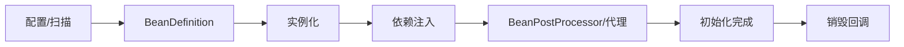

# Spring IoC、依赖注入与 Bean 生命周期

IoC 容器创建对象图、解析依赖并管理生命周期。依赖注入的目的不是减少 `new`，而是让依赖显式、可替换和可测试。

## 1. 本文覆盖范围

- ApplicationContext、BeanDefinition 与组件扫描
- 构造器/setter/字段注入、Qualifier/Primary
- Bean scope、生命周期、代理与循环依赖
- 配置属性、资源、事件与验证

## 2. 核心知识详解

### 1. 容器与 BeanDefinition

ApplicationContext 读取 Java 配置、组件扫描或 XML，形成 BeanDefinition，实例化单例并处理后置器。容器还提供事件、资源、国际化和类型转换。

- 组件扫描限定业务包，避免扫描整个 classpath。
- @Configuration/@Bean 适合第三方类型和显式装配。
- 启动失败应定位 Bean 创建链和根 cause，而非盲目加注解。

**正确性边界：** Spring Bean 默认 singleton 是“每个 ApplicationContext 一个实例”，不等于 JVM 全局单例，也不自动线程安全。

### 2. 依赖注入选择

构造器注入保证必需依赖在创建时完整，字段可 final，并便于普通单元测试。setter 适合真正可选或可重配置依赖；字段注入隐藏依赖且难以脱离容器。

- 单构造器通常无需 @Autowired。
- 多个同类型实现用语义接口、@Qualifier、@Primary/@Fallback 明确。
- 依赖过多提示类职责过重，应拆分而非继续堆构造参数。

**正确性边界：** Optional 注入不应掩盖配置错误；关键能力缺失应在启动阶段失败。

### 3. Scope、生命周期与销毁

singleton、prototype、request、session 等 scope 决定实例边界。初始化经过构造、属性注入、Aware、BeanPostProcessor、初始化回调；销毁回调只对容器管理且可追踪的生命周期生效。

- 外部资源 bean 实现关闭回调并在优雅停机时释放。
- prototype 注入 singleton 时要通过 Provider/ObjectProvider 获取新实例。
- request/session 数据不进入 singleton 可变字段。

**正确性边界：** 容器通常不管理 prototype Bean 的完整销毁生命周期，使用者承担清理。

### 4. 循环依赖与代理

构造器循环依赖无法建立完整对象图，应通过职责拆分、领域事件或中介服务消除。代理 Bean 可能使运行时类型与原类不同，影响 final 方法、equals 和 self-invocation。

- 不以 `@Lazy` 作为长期循环依赖修复。
- 按接口依赖降低实现耦合。
- 调试时检查 bean 实际类型和 advisor。

**正确性边界：** 容器能在部分 setter/字段场景“绕过”循环并不证明设计正确，且与代理/版本组合可能失败。

## 3. 工程链路



## 4. 最小可运行示例

下面的示例只保留关键路径。把它放入对应版本的最小工程，先运行测试或命令确认行为，再逐步加入重试、超时、监控和异常分支。

```java
@Service
final class CheckoutService {
  private final OrderRepository orders;
  private final PaymentPort payments;

  CheckoutService(OrderRepository orders, PaymentPort payments) {
    this.orders = orders;
    this.payments = payments;
  }
}
```

## 5. 实践与验证

1. 把字段注入服务重构为构造器注入并写无 Spring 单元测试。
2. 制造循环依赖，再通过职责拆分消除。
3. 记录一个代理 Bean 从定义到销毁的生命周期回调顺序。

## 6. 掌握检查

- [ ] 能解释 ApplicationContext 与 BeanDefinition。
- [ ] 能选择构造器、setter 和 Provider。
- [ ] 能区分 Bean scope 与线程安全。
- [ ] 能识别代理类型和生命周期边界。

## 参考资料

- [Spring IoC Container](https://docs.spring.io/spring-framework/reference/core/beans.html)
- [Bean Scopes](https://docs.spring.io/spring-framework/reference/core/beans/factory-scopes.html)
- [Annotation Configuration](https://docs.spring.io/spring-framework/reference/core/beans/annotation-config.html)
