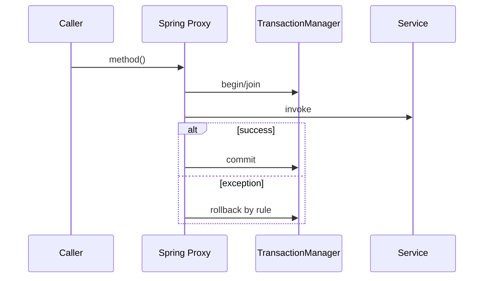

# Spring AOP、代理与声明式事务

Spring AOP 通过代理拦截 Spring Bean 的方法执行，声明式事务是其最重要应用之一。理解代理边界才能解释事务为何有时“失效”。

## 1. 本文覆盖范围

- join point、pointcut、advice、aspect 与 advisor
- JDK/CGLIB 类代理与 self-invocation
- @Transactional 传播、隔离、回滚和只读
- 事务事件、远程调用边界与测试

## 2. 核心知识详解

### 1. Spring AOP 模型

Spring AOP 只支持 Spring Bean 方法执行 join point，以 JDK 动态代理或类代理包装目标。before/after/around advice 通过 pointcut 选择方法。

- 横切关注点适合日志、指标、授权和事务，不承载核心业务流程。
- pointcut 尽量精确，避免无意代理整个应用。
- around advice 必须正确调用 proceed 并保留异常语义。

**正确性边界：** Spring AOP 不是完整 AspectJ；字段访问和任意对象构造等 join point 不在代理式 AOP 范围。

### 2. 代理与自调用

外部调用经过代理才能触发 advice；目标对象内部 `this.otherMethod()` 不经过代理，因此该方法上的事务/缓存/异步注解通常不会生效。

- 把事务边界放在外部应用服务公开方法。
- 需要复用时拆分到另一个 Bean，而非获取当前代理形成隐式耦合。
- final/private 方法不适合作为类代理拦截点。

**正确性边界：** 注解只是元数据，真正行为来自代理和 advisor；对象不由 Spring 管理时注解没有对应拦截器。

### 3. 事务传播与回滚

REQUIRED 加入现有事务或新建，REQUIRES_NEW 挂起外层并新建，NESTED 依赖 savepoint 支持。默认对 RuntimeException/Error 回滚，受检异常需通过 rollbackFor 或显式策略。

- 事务方法围绕一个本地数据库一致性边界。
- 捕获异常后若继续提交，要明确业务允许；否则重新抛出或标记 rollback-only。
- REQUIRES_NEW 需要额外连接，嵌套使用可能耗尽连接池。

**正确性边界：** `readOnly=true` 是优化提示和框架语义，不是数据库权限控制。

### 4. 远程调用与事务事件

数据库事务上下文不会自动跨 HTTP/RPC 传播。事务内调用远端会延长锁持有并产生“本地回滚、远端已成功”。可靠事件使用 outbox 或事务后回调。

- @TransactionalEventListener 按阶段执行，但进程崩溃下并不等于可靠消息。
- 事件必须有幂等 key、版本和重放策略。
- 集成测试验证真实数据库提交/回滚而非只 Mock。

**正确性边界：** 本地事务 + 发送消息的普通两步操作不是原子事务。

## 3. 工程链路

## 4. 实践与验证

1. 制造 self-invocation 导致事务未生效，再通过服务拆分修复。
2. 验证 REQUIRED/REQUIRES_NEW 在内外层异常组合下的提交结果。
3. 实现 transactional outbox 并测试进程重启后的重放。

## 5. 掌握检查

- [ ] 能解释代理式 AOP 的 join point 限制。
- [ ] 能说明事务注解失效的常见原因。
- [ ] 能选择传播和回滚规则。
- [ ] 能划清本地事务与远程调用边界。

## 参考资料

- [Spring AOP](https://docs.spring.io/spring-framework/reference/core/aop.html)
- [Spring AOP Capabilities](https://docs.spring.io/spring-framework/reference/core/aop/introduction-spring-defn.html)
- [Declarative Transactions](https://docs.spring.io/spring-framework/reference/data-access/transaction/declarative.html)
