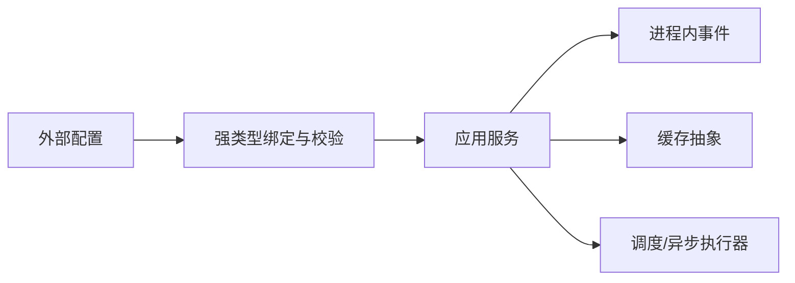

# Spring 资源、事件、校验、缓存与任务调度

Spring Core 还提供 Resource、事件、类型转换、Bean Validation 集成、缓存抽象和任务调度；这些能力必须带边界使用。

## 1. 本文覆盖范围

- Resource、Environment、PropertySource 与 profile
- ApplicationEvent 与同步/异步监听
- ConversionService、DataBinder 与 Bean Validation
- @Cacheable、@Scheduled、@Async 与执行器

## 2. 核心知识详解

### 1. 资源与环境

Resource 统一 classpath、文件和 URL 资源；Environment 聚合 profiles 与属性源。配置值应映射到强类型对象并在启动时校验。

- classpath 资源在 jar 中不一定能转成普通 File。
- profile 控制少量环境差异，不用于组合大量业务开关。
- 密钥通过专用 secret 机制，不打印到 endpoint 或日志。

**正确性边界：** Resource.getFile 只适用于真实文件资源；jar 内资源应使用 InputStream。

### 2. 应用事件

ApplicationEvent 默认同步调用监听器，发布者线程承担耗时和异常。异步监听需要明确 Executor、上下文传播、重试与丢失语义。

- 进程内事件用于解耦模块协作，不替代可靠消息系统。
- 监听器幂等且小，避免难追踪的事件链。
- 事务阶段监听明确 BEFORE_COMMIT/AFTER_COMMIT 等语义。

**正确性边界：** 标记 @Async 后，发布返回不表示监听成功；进程崩溃可能丢事件。

### 3. 转换、绑定与校验

ConversionService 负责类型转换，DataBinder 绑定外部属性，Bean Validation 用约束注解与分组校验对象。语法校验、业务不变量和数据库约束属于不同层。

- DTO 绑定采用字段白名单，避免 mass assignment。
- 错误消息不泄露内部字段或正则细节。
- 跨字段业务校验放类级约束或领域服务。

**正确性边界：** 前端校验只改善体验，后端与数据库仍必须执行权威校验。

### 4. 缓存、调度与异步

Spring Cache 是注解抽象，实际一致性取决于 cache manager；@Scheduled 触发任务，@Async 交给 Executor。三者都经过代理并受 self-invocation 约束。

- 缓存 key、TTL、空值和失效策略显式设计。
- 集群定时任务需要单实例选主、分布式调度或幂等执行。
- Executor 有界队列、拒绝策略、trace 和优雅关闭。

**正确性边界：** @Scheduled 默认并不保证集群只有一个节点执行，也不自动补跑错过任务。

## 3. 工程链路



## 4. 最小可运行示例

下面的示例只保留关键路径。把它放入对应版本的最小工程，先运行测试或命令确认行为，再逐步加入重试、超时、监控和异常分支。

```java
record OrderCreated(long orderId) {}

@TransactionalEventListener(phase = TransactionPhase.AFTER_COMMIT)
public void on(OrderCreated event) {
  notificationQueue.enqueue(event.orderId());
}

@Scheduled(cron = "0 */5 * * * *", zone = "Asia/Taipei")
void reconcilePendingOrders() { /* 幂等扫描 */ }
```

## 5. 实践与验证

1. 把散落配置重构为强类型 ConfigurationProperties 并添加启动校验。
2. 比较同步事件和异步事件的异常传播。
3. 在两个应用实例上运行定时任务，设计幂等和单执行方案。

## 6. 掌握检查

- [ ] 能正确读取 jar 内 classpath 资源。
- [ ] 能区分进程内事件与可靠消息。
- [ ] 能划分绑定校验、业务校验和数据库约束。
- [ ] 能解释缓存/异步/调度的代理与集群边界。

## 参考资料

- [Spring Resources](https://docs.spring.io/spring-framework/reference/core/resources.html)
- [Spring Validation](https://docs.spring.io/spring-framework/reference/core/validation/beanvalidation.html)
- [Spring Cache](https://docs.spring.io/spring-framework/reference/integration/cache.html)
- [Task Execution and Scheduling](https://docs.spring.io/spring-framework/reference/integration/scheduling.html)
