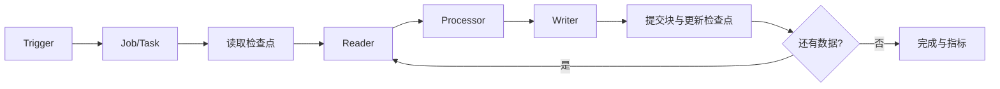

# Spring 异步、任务调度、Quartz 与 Spring Batch

后台任务需要明确触发方式、并发模型、幂等、持久状态、重试和可观测性。`@Async`、`@Scheduled`、Quartz 与 Spring Batch 分别解决不同复杂度，不应混为一个“定时器”。

## 1. 学习目标

- 理解线程池和上下文传播
- 掌握固定频率、固定延迟和 cron
- 理解 Quartz 持久触发与集群协调
- 理解 Batch 的 Job/Step/Reader/Processor/Writer 与重启

## 2. 核心概念

### 1. 异步执行

`@Async` 通过代理把方法提交给 Executor。需要设置有界队列、线程数、拒绝策略、异常处理与关闭等待，并明确安全上下文、MDC 和事务不会自然跨线程。

**正确边界：** 异步返回并不等于任务可靠持久化；进程崩溃时内存队列任务可能丢失。

### 2. 轻量调度

`@Scheduled` 适合单应用内可重入任务。fixedDelay 从上次完成后计时，fixedRate 按计划频率触发，cron 按日历表达并应明确时区。

**正确边界：** 多实例部署会各自触发；需用分布式锁、单独调度实例或外部调度器协调。

### 3. Quartz

Quartz 将 Job 与 Trigger 分离，可持久化触发状态，支持 misfire 策略和数据库集群。Job 应无状态或显式管理并发，业务动作仍要幂等。

**正确边界：** 调度器保证触发管理，不自动保证外部业务只执行一次。

### 4. Spring Batch

Batch 将批处理拆成 Job 和 Step；chunk 模式按块读、处理、写并提交，元数据记录执行状态以支持重启。大文件/大表需流式读取、稳定游标和失败跳过策略。

**正确边界：** skip/retry 必须限定异常和上限；盲目跳过会静默丢失业务数据。

## 3. 运行链路



## 4. 最小示例

```java
@Bean
Job importOrders(JobRepository jobs, Step importStep) {
  return new JobBuilder("importOrders", jobs)
      .start(importStep)
      .build();
}

@Bean
Step importStep(JobRepository jobs, PlatformTransactionManager tx,
    ItemReader<OrderRow> reader, ItemWriter<OrderRow> writer) {
  return new StepBuilder("importOrders.csv", jobs)
      .<OrderRow, OrderRow>chunk(200, tx)
      .reader(reader)
      .processor(row -> row.validated())
      .writer(writer)
      .build();
}
```

## 5. 练习与验证

1. 比较 fixedRate/fixedDelay 在慢任务下的时间线
2. 让批任务在第三个 chunk 失败并验证重启点
3. 为多实例 Quartz 任务验证幂等

## 6. 常见误区

- 用无界线程池掩盖背压
- 在定时任务中长时间占据数据库事务
- 每次重启都使用相同 JobParameters 导致实例冲突

## 7. 掌握检查

- [ ] 能不用术语堆砌，向初学者解释本主题解决的问题。
- [ ] 能运行示例并观察正常、边界和失败分支。
- [ ] 能说明该能力在完整 Java 后端链路中的位置和替换边界。
- [ ] 能以测试、执行计划、指标或规范条款验证关键结论。

## 参考资料

- [Spring Task Execution and Scheduling](https://docs.spring.io/spring-framework/reference/integration/scheduling.html)
- [Quartz Documentation](https://www.quartz-scheduler.org/documentation/)
- [Spring Batch Reference](https://docs.spring.io/spring-batch/reference/)
