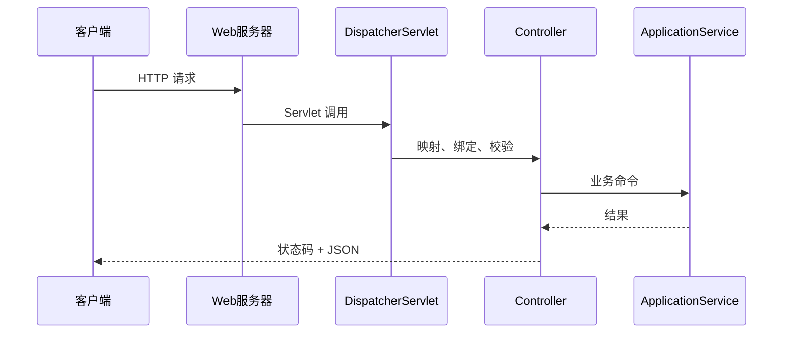

# Spring Boot 与 Web：从零开始的阶段导学

> 这一页是本阶段的入口，不假设读者已经接触过对应框架。先建立“为什么需要它、它在链路中的位置、如何验证”的心智模型，再进入各专题。

## 1. 本阶段解决什么问题

从浏览器发出 HTTP 请求开始，理解连接如何进入服务器、经过 Servlet 容器和 Spring MVC，最终被控制器、业务层与异常处理器转换为稳定响应；再学习 Boot 如何约定并自动配置这一链路。

### 前置知识

- 理解 Spring 容器和依赖注入
- 掌握 HTTP 方法、状态码、头与消息体的基本概念

## 2. 零基础词汇与心智模型

### 1. 自动配置

Boot 根据 classpath、属性和已有 Bean 的条件创建合理默认组件；用户定义通常可以覆盖默认值。

**学会的证据：** 能用条件评估报告说明某个配置为何生效。

### 2. 嵌入式服务器

Tomcat 等服务器监听端口、解析 HTTP 并把请求交给 Servlet；线程、连接、请求体和超时都有资源上限。

**学会的证据：** 能区分连接超时、读取超时和业务处理超时。

### 3. DispatcherServlet

它是 Spring MVC 前端控制器，借助映射、适配器、参数解析器、消息转换器和异常解析器完成请求分派。

**学会的证据：** 能按顺序描述一次 JSON 请求。

### 4. REST 契约

契约包括 URI、方法、状态码、输入输出 schema、鉴权、幂等、分页、错误与兼容策略。

**学会的证据：** 能为创建、查询、更新和冲突设计可测试接口。

## 3. 建议学习顺序

1. 用最小 Boot 应用观察启动报告
2. 跟踪 Servlet/MVC 请求链路
3. 设计 DTO、校验和错误契约
4. 接入 Actuator、日志、指标和追踪

## 4. 完整链路



## 5. 最小代码切片

```java
@RestController
class HealthController {
  @GetMapping("/ready")
  Map<String, String> ready() { return Map.of("status", "UP"); }
}
```

## 6. 第一个可验证练习

创建一个订单 REST 接口，覆盖合法请求、字段缺失、资源不存在、版本冲突和服务器异常；用 MockMvc 测试状态码、响应头与 Problem Details。

## 7. 初学者容易混淆的边界

- Controller 不应承担长事务和领域规则
- 返回 200 并在 JSON 中放错误码会削弱 HTTP 语义
- 自动配置是条件化代码，不是运行时魔法

## 8. 阶段验收

- [ ] 能解释请求分派链路
- [ ] 能设计统一错误响应
- [ ] 能安全暴露健康检查与指标

## 参考资料

- [Spring Boot Reference](https://docs.spring.io/spring-boot/reference/)
- [Spring MVC](https://docs.spring.io/spring-framework/reference/web/webmvc.html)
- [HTTP Semantics RFC 9110](https://www.rfc-editor.org/rfc/rfc9110)
