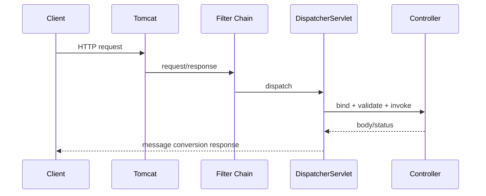

# Servlet、Tomcat 与 Spring MVC 请求完整链路

Spring MVC 建立在 Servlet 容器上。理解连接、过滤器、DispatcherServlet、HandlerMapping、参数解析和消息转换，才能定位 Web 问题。

## 1. 本文覆盖范围

- HTTP 连接、Tomcat Connector 与 Servlet 容器
- Filter、DispatcherServlet、Interceptor 与 Controller
- HandlerMapping/Adapter、ArgumentResolver、MessageConverter
- 线程模型、异步请求、文件上传与静态资源

## 2. 核心知识详解

### 1. Servlet 与容器

Servlet 容器管理 Servlet 生命周期并把 HTTP 请求映射为 HttpServletRequest/Response。Tomcat Connector 处理网络协议，容器线程执行 Filter 链和 Servlet。

- Servlet 通常单实例多线程调用，实例字段不可保存请求状态。
- Filter 适合容器级请求/响应包装、认证和关联 ID。
- 容器连接、线程、accept queue 和超时共同决定过载行为。

**正确性边界：** Tomcat 既是 Servlet 容器也提供 HTTP 服务器能力；Nginx 反代并不是运行 Spring MVC 的前提。

### 2. DispatcherServlet 调度

DispatcherServlet 根据 HandlerMapping 找 handler，通过 HandlerAdapter 调用，ArgumentResolver 解析参数，返回值处理器和 HttpMessageConverter 生成响应。

- Interceptor 位于 Spring MVC handler 链，不能替代容器 Filter 的所有场景。
- JSON 序列化、内容协商、校验和异常解析各由独立组件负责。
- 控制器保持薄，事务与业务逻辑进入应用服务。

**正确性边界：** Controller 方法并不是由浏览器直接反射调用，中间存在映射、绑定、校验、转换和异常处理。

### 3. 请求绑定与响应

@PathVariable、@RequestParam、@RequestHeader、@RequestBody 对应不同输入来源。内容类型决定消息转换器，Accept 参与响应内容协商。

- DTO 与实体分离，字段白名单绑定。
- 上传限制总大小、单文件、类型、文件名和存储路径。
- 流式响应和下载正确设置 Content-Type、Disposition 与缓存。

**正确性边界：** 仅检查文件扩展名不足以识别内容类型，且用户文件名不得直接作为服务器路径。

### 4. 线程模型与异步

传统 MVC 请求占用容器线程直到完成；Callable/DeferredResult 可释放容器线程等待异步结果，但实际工作仍需受控 Executor。虚拟线程可简化阻塞代码但下游资源仍有限。

- 请求上下文、SecurityContext、MDC/trace 跨异步边界显式传播。
- 设置请求截止时间并取消下游操作。
- 响应提交后异常无法再正常改写状态码。

**正确性边界：** 异步/虚拟线程不自动提供背压，必须限制队列、连接和并发。

## 3. 工程链路



## 4. 最小可运行示例

下面的示例只保留关键路径。把它放入对应版本的最小工程，先运行测试或命令确认行为，再逐步加入重试、超时、监控和异常分支。

```java
@RestController
@RequestMapping("/api/orders")
final class OrderController {
  @GetMapping("/{id}")
  OrderView find(@PathVariable long id) {
    return service.find(id);
  }
}
```

## 5. 实践与验证

1. 为同一接口分别编写 Filter、Interceptor 和 Controller 日志，观察顺序。
2. 自定义 HandlerMethodArgumentResolver 解析当前租户。
3. 压测慢下游下容器线程池、虚拟线程与连接池的关系。

## 6. 掌握检查

- [ ] 能画出 Tomcat 到 Controller 的调用链。
- [ ] 能区分 Filter 与 Interceptor。
- [ ] 能解释参数解析和消息转换。
- [ ] 能设计异步上下文传播与超时。

## 参考资料

- [Spring MVC](https://docs.spring.io/spring-framework/reference/web/webmvc.html)
- [DispatcherServlet](https://docs.spring.io/spring-framework/reference/web/webmvc/mvc-servlet.html)
- [Jakarta Servlet](https://jakarta.ee/specifications/servlet/)
- [Apache Tomcat Documentation](https://tomcat.apache.org/)
