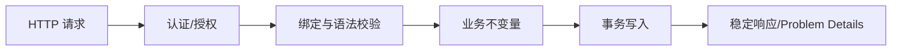

# REST API：资源建模、HTTP 语义、校验、错误处理与版本演进

REST API 的正确性来自 HTTP 语义、资源模型、幂等性、错误契约和兼容演进，而不是 URL 是否“看起来像名词”。

## 1. 本文覆盖范围

- URI、HTTP method、status、header 与缓存
- DTO、Bean Validation、Problem Details 与异常映射
- 分页、过滤、排序、幂等键与并发控制
- OpenAPI、版本、兼容与弃用

## 2. 核心知识详解

### 1. 资源与 HTTP 语义

GET 安全且幂等，PUT 幂等地替换/更新已知资源，DELETE 幂等但响应内容可变化，POST 通常创建或执行非幂等动作。状态码和 header 共同表达结果。

- 201 返回 Location，204 无响应体，409 表达状态冲突，422 可表达语义校验失败。
- Cache-Control、ETag、If-Match/If-None-Match 支持缓存与乐观并发。
- 不要用所有请求都返回 200 + 自定义 code 抹掉 HTTP 语义。

**正确性边界：** 幂等表示重复相同请求的预期服务端效果一致，不表示每次响应字节完全相同。

### 2. DTO、校验与错误契约

请求/响应 DTO 隔离领域和持久化模型。Bean Validation 处理字段/跨字段约束，服务层处理依赖当前状态的业务规则，数据库约束做最终保护。

- 错误响应采用 RFC Problem Details 或等价稳定结构，含 type/title/status/detail/instance/traceId。
- 参数错误定位字段但不回显敏感输入。
- 统一异常处理只映射已知类型，未知异常返回通用信息并记录完整 cause。

**正确性边界：** 校验注解不能替代授权、状态检查和唯一约束。

### 3. 分页、排序与幂等

offset 分页简单但深页慢且并发变更会漂移；keyset/cursor 分页基于稳定唯一排序。POST 重试可用幂等键把业务结果与请求标识关联。

- 限制 pageSize、过滤复杂度和排序白名单。
- 幂等记录包含请求摘要、状态和响应，处理并发首次请求。
- 创建操作同时依赖数据库唯一约束。

**正确性边界：** 幂等键不是普通缓存 key；必须定义作用域、过期、请求内容冲突和处理中状态。

### 4. OpenAPI 与兼容演进

OpenAPI 描述路径、schema、响应和安全方案，可生成客户端/校验和契约测试。兼容演进优先新增可选字段；删除、重命名、收紧枚举都可能破坏客户端。

- 契约纳入版本控制和 CI diff。
- 宽容读取不等于忽略未知错误；服务端明确 additionalProperties 策略。
- 弃用记录日期、替代方案、使用量和移除条件。

**正确性边界：** 在响应增加字段对严格反序列化客户端也可能是破坏性变更，需要真实消费者契约验证。

## 3. 工程链路

## 4. 实践与验证

1. 设计订单 API，覆盖 ETag、幂等创建和 keyset 分页。
2. 生成 OpenAPI 并对破坏性 schema 变更做 CI 检查。
3. 为 400/401/403/404/409/422/500 建统一错误契约测试。

## 5. 掌握检查

- [ ] 能正确选择 HTTP method/status。
- [ ] 能划分 DTO 校验、业务校验和数据库约束。
- [ ] 能设计稳定分页和幂等键。
- [ ] 能识别 API 破坏性变更。

## 参考资料

- [HTTP Semantics RFC 9110](https://www.rfc-editor.org/rfc/rfc9110)
- [Problem Details RFC 9457](https://www.rfc-editor.org/rfc/rfc9457)
- [OpenAPI Specification](https://spec.openapis.org/oas/latest.html)
- [Spring MVC REST](https://docs.spring.io/spring-framework/reference/web/webmvc/mvc-controller.html)
