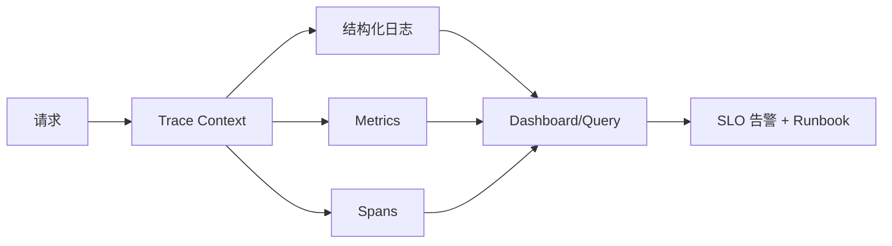

# Spring Boot Actuator、日志、指标、追踪与生产配置

生产级 Boot 服务需要 health、metrics、traces、logs、审计和安全暴露策略形成诊断闭环。

## 1. 本文覆盖范围

- Actuator endpoint、health group 与 probes
- 结构化日志、MDC、敏感信息和采样
- Micrometer metrics 与高基数控制
- OpenTelemetry trace/context 与告警

## 2. 核心知识详解

### 1. Actuator endpoint 与安全

Actuator 提供 health、metrics、env、configprops、loggers、threaddump 等生产端点。默认暴露应最小化，管理端口/网络与鉴权独立控制。

- liveness 只判断是否应重启，readiness 判断是否接流量。
- 自定义 HealthIndicator 设置短超时，不把所有外部依赖放 liveness。
- env/configprops 可能包含敏感值，生产严格限制。

**正确性边界：** 数据库短暂不可用通常不应让 liveness 失败并触发所有实例重启。

### 2. 结构化日志与关联

日志是离散事件，包含时间、level、service、trace/span、请求/业务标识和安全上下文。MDC 在线程切换和异步边界需要传播并清理。

- 不记录密码、token、完整卡号和大请求体。
- 异常记录一次完整 cause，避免层层重复打同一堆栈。
- 日志级别可动态调整但需权限和审计。

**正确性边界：** 日志量不是可观测性质量；无结构、无关联和无语义的海量日志仍难诊断。

### 3. 指标与高基数

Micrometer 用 Counter、Gauge、Timer、DistributionSummary 等抽象导出指标。tag 维度决定时间序列数量，userId/orderId 等高基数标签会冲垮后端。

- 以 RED（Rate/Error/Duration）和资源饱和度建立仪表盘。
- 延迟使用 histogram/percentile 并理解聚合方式。
- 业务指标定义单位、所有者和告警动作。

**正确性边界：** 客户端计算平均百分位不能在实例间正确聚合；使用可合并直方图桶。

### 4. 分布式追踪与告警

trace 由 spans 组成，通过 context propagation 跨 HTTP/消息边界。OpenTelemetry 统一 traces、metrics、logs API/协议；采样影响成本与可见性。

- 入口生成/验证 trace context，异步消息携带上下文。
- 错误与高延迟可尾采样，关键业务保留策略明确。
- 告警基于 SLO 和用户影响，附带 runbook。

**正确性边界：** trace 显示相关调用链，不自动证明因果；仍需日志、指标和代码证据交叉验证。

## 3. 工程链路

## 4. 实践与验证

1. 为订单接口接入 Actuator、Timer 和 trace，构造一次跨服务慢请求。
2. 验证异步线程池中 MDC/trace 是否传播与清理。
3. 设计 readiness/liveness 并模拟数据库和自身死锁故障。

## 5. 掌握检查

- [ ] 能安全暴露 Actuator。
- [ ] 能区分 liveness 与 readiness。
- [ ] 能控制指标标签基数。
- [ ] 能用日志、指标、trace 联合定位。

## 参考资料

- [Spring Boot Actuator](https://docs.spring.io/spring-boot/reference/actuator/)
- [Production-ready Features](https://docs.spring.io/spring-boot/reference/actuator/index.html)
- [Micrometer Documentation](https://docs.micrometer.io/micrometer/reference/)
- [OpenTelemetry Java](https://opentelemetry.io/docs/languages/java/)
