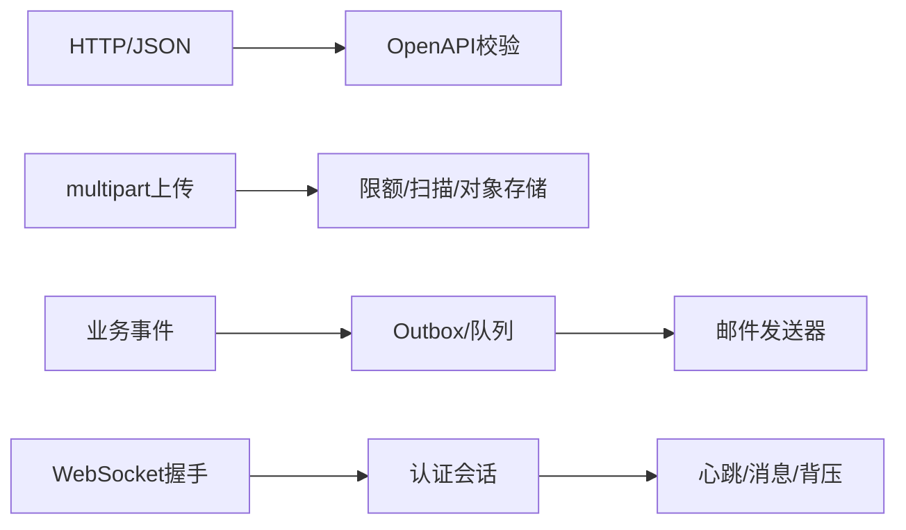

# OpenAPI、文件处理、邮件与 WebSocket

真实 Web 服务除 JSON CRUD 外，还需要契约文档、文件流、异步通知和双向通信。每类能力都有独立的资源限制、安全边界与失败模型。

## 1. 学习目标

- 用 OpenAPI 描述与验证接口
- 安全处理上传下载和大文件流
- 理解邮件提交与投递结果
- 掌握 WebSocket 握手、会话、心跳和背压

## 2. 核心概念

### 1. OpenAPI 契约

OpenAPI 描述路径、参数、schema、响应和安全方案，可生成文档、客户端与契约测试。契约应纳入版本控制并在 CI 检查破坏性变更。

**正确边界：** 自动生成文档不替代业务语义和示例；运行时输入仍需校验。

### 2. 上传与下载

multipart 上传需要限制请求/单文件大小、文件数、媒体类型和文件名；内容应流式处理、生成服务端对象名并进行扫描。下载需设置正确 Content-Type、Content-Disposition、长度与缓存头。

**正确边界：** 不要把客户端文件名直接拼接为文件系统路径；扩展名也不能证明真实内容。

### 3. 邮件

应用通常把邮件任务写入可靠队列，由发送器使用 SMTP/API 提交。提交成功只表示上游接受，不保证最终送达；退信、投诉、重试和模板版本需要记录。

**正确边界：** 数据库事务内直接调用邮件服务会延长事务且难以处理提交后失败。

### 4. WebSocket

WebSocket 从 HTTP Upgrade 建立全双工连接。服务端需认证握手、限制消息、维护心跳/超时、处理慢消费者，并在多实例间用消息层广播。

**正确边界：** 连接建立时认证成功不代表永久授权；长期会话需处理权限变化和令牌到期。

## 3. 运行链路



## 4. 最小示例

```java
@PostMapping(path = "/files", consumes = MediaType.MULTIPART_FORM_DATA_VALUE)
ResponseEntity<FileView> upload(@RequestPart MultipartFile file) throws IOException {
  if (file.isEmpty() || file.getSize() > 10 * 1024 * 1024) {
    throw new ResponseStatusException(HttpStatus.PAYLOAD_TOO_LARGE);
  }
  String objectKey = UUID.randomUUID().toString();
  try (InputStream input = file.getInputStream()) {
    storage.put(objectKey, input, file.getSize(), file.getContentType());
  }
  return ResponseEntity.status(HttpStatus.CREATED)
      .body(new FileView(objectKey, file.getOriginalFilename()));
}
```

## 5. 练习与验证

1. 对 OpenAPI 做破坏性 diff
2. 上传伪造扩展名和超限文件并验证拒绝
3. 模拟慢 WebSocket 消费者并验证队列上限

## 6. 常见误区

- 把完整上传读入 byte[] 导致堆峰值
- 把 SMTP 250 当作用户已读
- WebSocket 自动获得 HTTP 接口的全部限流与授权

## 7. 掌握检查

- [ ] 能不用术语堆砌，向初学者解释本主题解决的问题。
- [ ] 能运行示例并观察正常、边界和失败分支。
- [ ] 能说明该能力在完整 Java 后端链路中的位置和替换边界。
- [ ] 能以测试、执行计划、指标或规范条款验证关键结论。

## 参考资料

- [OpenAPI Specification](https://spec.openapis.org/oas/latest.html)
- [Spring Multipart Forms](https://docs.spring.io/spring-framework/reference/web/webmvc/mvc-controller/ann-methods/multipart-forms.html)
- [Spring WebSocket](https://docs.spring.io/spring-framework/reference/web/websocket.html)
