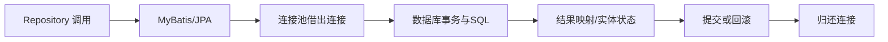

# 数据访问与 ORM：从零开始的阶段导学

> 这一页是本阶段的入口，不假设读者已经接触过对应框架。先建立“为什么需要它、它在链路中的位置、如何验证”的心智模型，再进入各专题。

## 1. 本阶段解决什么问题

把对象与关系数据之间的读写变成可测试、可调优、可迁移的工程链路。学习 JDBC 的真实资源边界后，再理解 MyBatis 的显式 SQL、JPA/Hibernate 的对象状态管理和 Spring Data 的仓库抽象。

### 前置知识

- 掌握 SQL、索引、事务和 JDBC
- 理解对象标识、集合关系与异常

## 2. 零基础词汇与心智模型

### 1. 映射

映射把结果集列转换为对象字段。MyBatis 让开发者控制 SQL；ORM 还维护实体身份、关联和状态变化。

**学会的证据：** 能识别列名、空值和一对多结果展开问题。

### 2. 持久化上下文

JPA 在一个上下文中保证同一实体标识对应同一受管理实例，并在 flush 时执行脏检查生成 SQL。

**学会的证据：** 能区分 persist、merge、flush 与 commit。

### 3. N+1 查询

先查 N 个主体，再为每个主体额外查关联，导致请求数随数据量线性增长。

**学会的证据：** 能用日志/指标发现并用 join fetch、实体图或批量查询修复。

### 4. 连接池与迁移

连接池复用有限数据库会话；迁移工具按版本执行可审计的 schema 变更。

**学会的证据：** 能估算池大小并写前向兼容的两阶段变更。

## 3. 建议学习顺序

1. 先观察 JDBC 连接、事务和结果集
2. 学习 MyBatis 显式映射
3. 学习 JPA 实体生命周期
4. 加入连接池、迁移、监控和决策标准

## 4. 完整链路



## 5. 最小代码切片

```java
@Transactional(readOnly = true)
public OrderView find(long id) {
  return repository.findViewById(id).orElseThrow(NotFoundException::new);
}
```

## 6. 第一个可验证练习

分别用 MyBatis 和 JPA 实现订单列表，记录 SQL 数量、分页语句和事务边界；制造 N+1，再用批量查询修复并通过集成测试验证。

## 7. 初学者容易混淆的边界

- ORM 不会消除 SQL 与索引知识
- Open Session in View 会把懒加载和连接占用扩散到 Web 层
- 连接池越大并不必然吞吐越高

## 8. 阶段验收

- [ ] 能选择 MyBatis/JPA
- [ ] 能解释 flush 与事务提交
- [ ] 能通过 SQL 证据定位 N+1

## 参考资料

- [MyBatis Documentation](https://mybatis.org/mybatis-3/)
- [Jakarta Persistence Specification](https://jakarta.ee/specifications/persistence/)
- [Spring Data JPA](https://docs.spring.io/spring-data/jpa/reference/)
