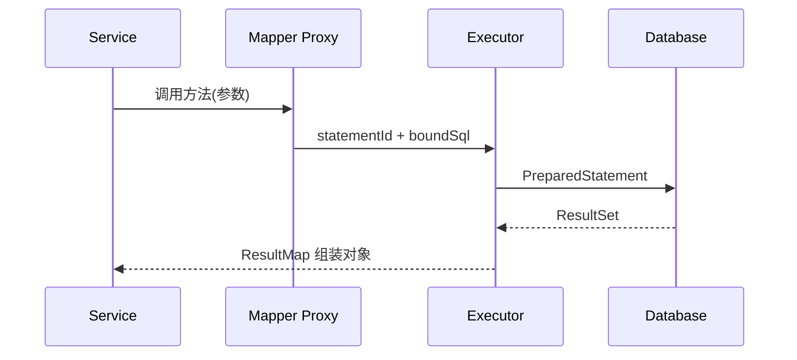

# MyBatis：映射、动态 SQL、插件与工程边界

MyBatis 保留 SQL 主导权，并负责参数绑定、结果映射、会话及缓存等基础设施；它不是自动生成全部查询的 ORM。

## 1. 本文覆盖范围

- SqlSession 与 Mapper 代理
- 参数绑定、ResultMap 与关联映射
- 动态 SQL、批处理和分页
- 一级/二级缓存与插件

## 2. 核心知识详解

### 1. 执行链与生命周期

`SqlSessionFactory` 是长期共享工厂，`SqlSession` 表示一次非线程安全的数据库会话；Spring 集成会把会话和事务绑定到当前执行上下文。

- Mapper 接口由代理转成 statement id 和参数对象。
- Executor、StatementHandler、ParameterHandler、ResultSetHandler 构成核心执行链。
- 会话使用 try-with-resources 或由 Spring 管理，禁止跨线程共享。

**正确性边界：** Mapper 代理可作为线程安全的注入对象，但代理内部使用的会话必须由框架按操作/事务管理。

### 2. 参数与结果映射

`#{}` 使用预编译参数，`${}` 是文本替换；复杂结果通过 ResultMap 显式描述列、属性、标识列和嵌套关系。

- 默认使用 `#{}`，动态表名/排序列通过白名单映射后再拼接。
- 用 `<id>` 标识对象身份，避免一对多联接重复组装。
- 数据库命名与 Java 属性命名差异可显式映射或统一下划线转换。

**正确性边界：** `${}` 不做参数化，直接接收请求值会形成注入入口；即使是 ORDER BY 也应映射到固定列名。

### 3. 动态 SQL、批处理与分页

`if/choose/trim/where/set/foreach` 用于按条件生成 SQL。批量写入、分页和大结果集必须结合数据库方言与执行计划。

- 空集合、空条件和批量大小均设显式边界。
- 深分页优先基于稳定排序键做 keyset/seek pagination。
- 批处理提交按数据量切块，并准确处理部分失败。

**正确性边界：** 客户端一次构造超长 IN 列表既可能超过数据库限制，也会增加解析与网络成本。

### 4. 缓存与插件

一级缓存限定在 SqlSession；二级缓存按 namespace 共享。插件可拦截 Executor、StatementHandler 等接口，但会影响全局语义。

- 事务写入会使相关缓存失效，跨系统更新仍需额外一致性方案。
- 分页、审计或租户插件应有 SQL 边界测试。
- 优先使用显式服务逻辑，插件只承载稳定横切规则。

**正确性边界：** 二级缓存不是 Redis 的替代，也不保证与数据库外部写入实时一致。

## 3. 工程链路

## 4. 实践与验证

1. 实现带白名单排序和 seek 分页的订单查询。
2. 对一对多映射分别测试 join 和分步查询，比较 SQL 数与数据量。
3. 用数据库真实执行计划验证索引，而不是只看生成的 SQL。

## 5. 掌握检查

- [ ] 能解释 `#{}` 与 `${}` 的边界。
- [ ] 能定位 N+1 和映射重复。
- [ ] 能说明一级/二级缓存失效范围。
- [ ] 能为动态 SQL 写边界测试。

## 参考资料

- [MyBatis 3 Reference](https://mybatis.org/mybatis-3/)
- [MyBatis Spring](https://mybatis.org/spring/)
