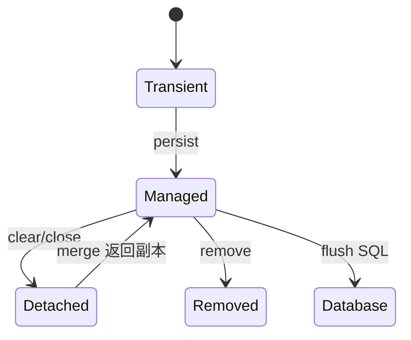

# JPA、Hibernate 与 Spring Data：实体状态、映射和查询

Jakarta Persistence 是规范，Hibernate 是常见实现，Spring Data JPA 在其上提供仓库抽象；三者的职责需要分开理解。

## 1. 本文覆盖范围

- 实体生命周期与持久化上下文
- 关联、继承和值对象映射
- JPQL、Criteria、Specification 与原生 SQL
- 抓取策略、锁和批处理

## 2. 核心知识详解

### 1. 持久化上下文与脏检查

实体处于 transient、managed、detached、removed 等状态。持久化上下文保证同一标识的对象身份，并在 flush 时通过脏检查生成 SQL。

- `persist` 管理新实体，`merge` 返回受管副本，原对象仍可能是 detached。
- flush 将变更同步到数据库连接，不等于事务已经提交。
- 长事务会让上下文积累对象，批处理时分批 flush/clear。

**正确性边界：** 看到对象字段已变不代表其他事务已可见；可见性由数据库隔离和提交决定。

### 2. 关联与聚合边界

一对一、一对多、多对一和多对多映射描述对象关系，但领域聚合和数据库外键仍需独立设计。

- 双向关联由 owning side 写入外键，双方对象引用由业务代码保持一致。
- 集合默认避免 EAGER；查询用 fetch join、EntityGraph 或 DTO 投影显式取数。
- 多对多含业务属性时建独立关联实体。

**正确性边界：** 把所有关系设为 EAGER 会产生笛卡尔积、重复数据或不可控查询，并不等于消除 N+1。

### 3. 查询抽象选择

派生查询适合简单条件；JPQL 面向实体；Specification/Criteria 适合组合条件；复杂报表或方言特性可用原生 SQL/专用查询层。

- 列表接口优先 DTO 投影，避免序列化实体图。
- 分页同时提供稳定排序，并审查 count 查询成本。
- 查询结果数量和 SQL 次数纳入自动化测试。

**正确性边界：** Repository 方法名很长通常说明查询语义已超出派生查询的可读范围。

### 4. 并发控制与批处理

乐观锁通过版本列检测丢失更新，悲观锁由数据库锁定记录/范围。批处理还受主键生成策略、flush 频率和 JDBC batching 影响。

- 捕获乐观锁冲突后按业务语义提示或有限重试。
- 锁顺序固定、事务短小，减少死锁窗口。
- 批量导入与在线事务使用不同资源配额。

**正确性边界：** 自动重试整个非幂等业务可能重复外部副作用；重试边界必须明确。

## 3. 工程链路

## 4. 实践与验证

1. 建立订单、订单项和值对象映射，写出数量、SQL 次数和事务边界测试。
2. 演示 N+1、fetch join、DTO 投影三种方案并比较结果。
3. 用 `@Version` 构造并发更新冲突。

## 5. 掌握检查

- [ ] 能区分规范、实现和仓库抽象。
- [ ] 能解释 flush/commit。
- [ ] 能选择抓取策略。
- [ ] 能处理乐观锁冲突。

## 参考资料

- [Spring Data JPA Reference](https://docs.spring.io/spring-data/jpa/reference/jpa.html)
- [Hibernate ORM Documentation](https://hibernate.org/orm/documentation/)
- [Jakarta Persistence Specification](https://jakarta.ee/specifications/persistence/)
