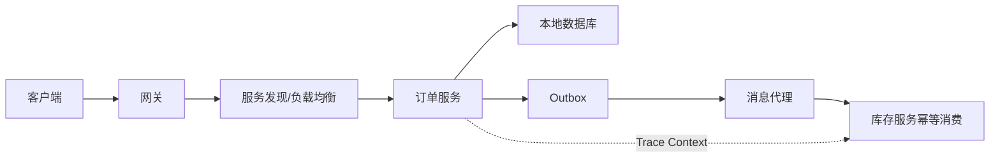

# 分布式系统与微服务：从零开始的阶段导学

> 这一页是本阶段的入口，不假设读者已经接触过对应框架。先建立“为什么需要它、它在链路中的位置、如何验证”的心智模型，再进入各专题。

## 1. 本阶段解决什么问题

理解网络分区、延迟、重复、乱序和局部失败为何让远程调用不同于本地方法，并据此设计服务边界、发现、配置、网关、容错、事务与观测链路。先掌握失败语义，再学习组件。

### 前置知识

- 能独立开发和测试模块化单体
- 理解数据库事务、HTTP 与消息队列基础

## 2. 零基础词汇与心智模型

### 1. 局部失败

调用方、网络和被调方可处于不同状态；超时只说明在期限内未收到响应，不证明操作未执行。

**学会的证据：** 能为写操作设计幂等键与状态查询。

### 2. 服务发现

实例动态上下线时，注册中心维护可用地址元数据，客户端或代理据此选择实例。

**学会的证据：** 能处理健康检查、缓存和注册中心短暂失联。

### 3. 熔断与隔离

超时限制等待，舱壁限制资源，熔断在高失败率时暂缓请求；重试只适用于可重试且具备幂等性的失败。

**学会的证据：** 能给出总 deadline 下的超时与重试预算。

### 4. 最终一致性

跨服务业务常用本地事务、可靠事件、幂等消费与补偿收敛，而非假设一个数据库事务覆盖所有资源。

**学会的证据：** 能画出 Outbox 发布和消费去重链路。

## 3. 建议学习顺序

1. 先用模块化单体明确边界
2. 理解超时、幂等、重试与一致性
3. 再学习发现、配置、网关和 RPC
4. 最后实践分布式事件、治理与追踪

## 4. 完整链路



## 5. 最小代码切片

```java
record Command(UUID idempotencyKey, long orderId) {}
// 接收端以 idempotencyKey 建唯一约束，重复请求返回首次结果。
```

## 6. 第一个可验证练习

把单体订单系统中的库存模块抽成独立进程；为调用设置 deadline、幂等键和状态查询，并在响应丢失、重复投递与消费者重启三个场景验证结果。

## 7. 初学者容易混淆的边界

- 微服务不是按技术层拆进程
- 重试会放大拥塞，层层重试形成乘法效应
- CAP 不表示任意时刻只能从一致性、可用性和分区容忍三选二

## 8. 阶段验收

- [ ] 能区分本地调用与远程调用
- [ ] 能设计幂等和可靠事件
- [ ] 能解释网关、注册、配置、限流、熔断的职责

## 参考资料

- [Spring Cloud](https://docs.spring.io/spring-cloud-reference/)
- [Spring Cloud Alibaba](https://sca.aliyun.com/en/)
- [gRPC Documentation](https://grpc.io/docs/)
