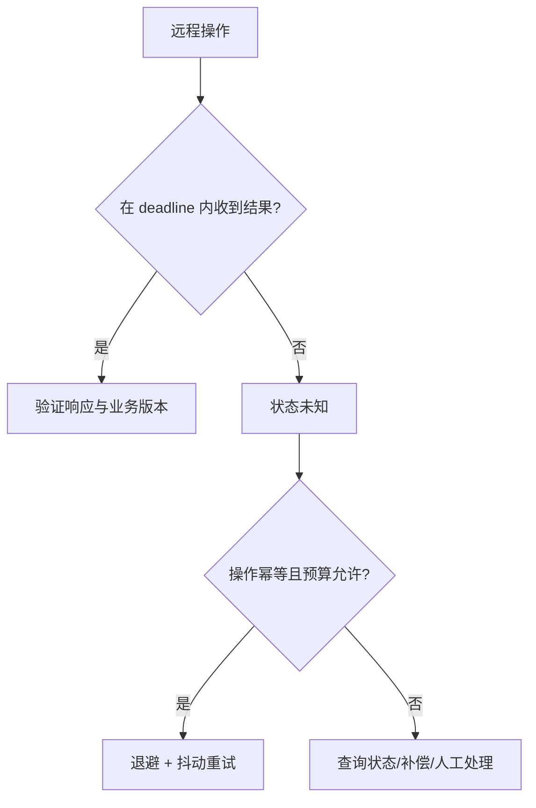

# 分布式基础：故障模型、CAP、BASE、复制与共识

分布式系统的难点来自网络延迟、部分失败、并发和缺少全局时钟；术语必须放回具体模型与业务不变量中。

## 1. 本文覆盖范围

- 故障、超时和时间
- CAP 与一致性模型
- 复制、quorum 与冲突
- Paxos、Raft 与 Gossip

## 2. 核心知识详解

### 1. 部分失败与时间

调用超时只能说明截止时间内没有收到结果，远端可能未执行、正在执行或已成功但响应丢失。网络分区、进程暂停和时钟漂移使状态判断具有不确定性。

- 所有远程调用设置 deadline，并把剩余预算向下游传播。
- 重试采用退避、抖动、上限和幂等键。
- 业务顺序依赖逻辑版本/序列，而不是直接相信墙上时钟。

**正确性边界：** timeout 不是失败证明；无条件重试可能重复扣款或制造重试风暴。

### 2. CAP 的精确含义

CAP 讨论发生网络分区时，系统在一致性与可用性之间的选择。这里的一致性通常指线性一致，可用性要求每个非故障节点对请求给出非错误响应。

- 没有分区时仍需考虑延迟、事务隔离、持久性与成本。
- 同一系统可对不同数据采用不同策略。
- BASE 是工程理念缩写，不是一个可计算的一致性等级。

**正确性边界：** 把数据库贴成永久的 CP/AP 标签会掩盖具体配置、操作类型和故障条件。

### 3. 复制与一致性模型

主从、多主、无主复制在写入路径、冲突和故障转移上不同。线性一致、顺序一致、因果一致、最终一致提供不同可观察保证。

- 读写 quorum 关系只在特定复制假设下提供重叠，不自动等于线性一致。
- 复制延迟会导致读到旧值、单调读破坏或 read-your-writes 破坏。
- 冲突通过版本、业务合并、CRDT 或人工处理。

**正确性边界：** 最终一致只说明没有新更新后副本趋同，并未给出收敛时间或冲突语义。

### 4. 共识与 Gossip

Paxos 和 Raft 用于在故障模型下就日志/值达成一致；Raft 以 leader、term、log replication 和 majority 描述。Gossip 适合大规模成员与状态传播，通常追求最终收敛。

- 共识组多数可用才可持续提交，成员数量影响容错与开销。
- leader election 不等于业务主从切换的全部步骤。
- Gossip 传播快且去中心化，但不提供线性一致提交。

**正确性边界：** Raft 不是分布式锁 API；上层仍需 fencing token、租约和业务状态机。

## 3. 工程链路



## 4. 最小可运行示例

下面的示例只保留关键路径。把它放入对应版本的最小工程，先运行测试或命令确认行为，再逐步加入重试、超时、监控和异常分支。

```java
record VersionedValue(String value, long version) {}

VersionedValue update(VersionedValue current, String next, long expectedVersion) {
  if (current.version() != expectedVersion) throw new ConflictException();
  return new VersionedValue(next, current.version() + 1);
}
```

## 5. 实践与验证

1. 构造响应丢失场景，设计订单创建的幂等键与状态查询。
2. 画出三副本 Raft 在一个节点故障时的提交条件。
3. 为用户资料和余额分别选择一致性模型并说明不变量。

## 6. 掌握检查

- [ ] 能准确陈述 CAP 条件。
- [ ] 能解释 timeout 的不确定性。
- [ ] 能区分共识与 Gossip。
- [ ] 能把一致性选择落到业务不变量。

## 参考资料

- [CAP FAQ](https://www.cs.utexas.edu/~lorenzo/corsi/cs380d/papers/CAP.pdf)
- [Raft](https://raft.github.io/)
- [SWIM Paper](https://www.cs.cornell.edu/projects/Quicksilver/public_pdfs/SWIM.pdf)
