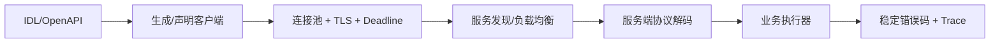

# 服务通信：HTTP、OpenFeign、Dubbo、gRPC 与 Netty

通信技术选择取决于契约、互操作、延迟、流式需求和运维能力；框架封装不会消除远程调用故障。

## 1. 本文覆盖范围

- HTTP/REST 与契约
- OpenFeign 声明式客户端
- Dubbo 与 gRPC
- Netty 事件循环与背压

## 2. 核心知识详解

### 1. 契约与兼容

服务契约包含路径/方法或 RPC 方法、字段类型、错误模型、认证、超时和幂等语义。演进遵循添加优先、宽读严写与兼容窗口。

- OpenAPI/Protobuf 作为可评审和生成代码的契约。
- 字段删除、重命名、枚举扩展和语义变化均评估旧客户端。
- 错误用稳定 code 表达，文本只作诊断。

**正确性边界：** HTTP 200 包裹所有错误会破坏缓存、网关、监控和客户端通用处理。

### 2. OpenFeign 与 HTTP 客户端

OpenFeign 将 Java 接口声明映射为 HTTP 请求，便于 Spring Cloud 集成；底层仍需要连接池、DNS、TLS、序列化、deadline 和错误解码。

- 连接超时与读取超时分开，并设总 deadline。
- 对可重试方法标注幂等性，限制重试层数。
- 记录目标服务、方法、状态、延迟和 trace，不记录密钥。

**正确性边界：** 在网关、客户端库和服务网格同时重试会放大流量，重试所有权需唯一且可观测。

### 3. Dubbo 与 gRPC

Dubbo 提供服务发现、流量治理和多协议 RPC；gRPC 以 Protobuf 和 HTTP/2 提供 unary、server/client/bidirectional streaming。两者都需要兼容契约和治理。

- 流式调用明确背压、取消和半关闭语义。
- 跨语言与外部开放接口优先评估生态和代理兼容。
- 负载均衡统计与服务发现健康状态必须联动。

**正确性边界：** 二进制协议通常更紧凑，但端到端性能还受业务处理、TLS、连接复用和消息大小影响。

### 4. Netty 事件循环

Netty 用 EventLoop 处理 channel 事件，pipeline 中的 handler 负责解码、业务和编码。事件循环线程上阻塞会拖慢同一 loop 的多个连接。

- 协议帧定义长度/边界，限制消息大小以避免内存攻击。
- 阻塞业务移交有界执行器，并把结果安全写回 event loop。
- 高/低水位、读取控制和队列上限实现背压。

**正确性边界：** 增加工作线程不会自动解决下游阻塞；队列无界只会把过载变成内存和尾延迟问题。

## 3. 工程链路

## 4. 实践与验证

1. 用 OpenAPI 或 Protobuf 定义可兼容演进的订单契约。
2. 在客户端加入 deadline、幂等重试和指标，模拟慢响应。
3. 写一个 Netty 长度字段协议并验证半包、粘包和超大帧。

## 5. 掌握检查

- [ ] 能设计兼容契约。
- [ ] 能控制多层重试。
- [ ] 能解释流式背压。
- [ ] 能避免阻塞 EventLoop。

## 参考资料

- [Netty Documentation](https://netty.io/wiki/)
- [Apache Dubbo Documentation](https://dubbo.apache.org/en/overview/what/overview/)
- [gRPC Java Basics](https://grpc.io/docs/languages/java/basics/)
- [Spring Cloud OpenFeign](https://docs.spring.io/spring-cloud-openfeign/reference/)
