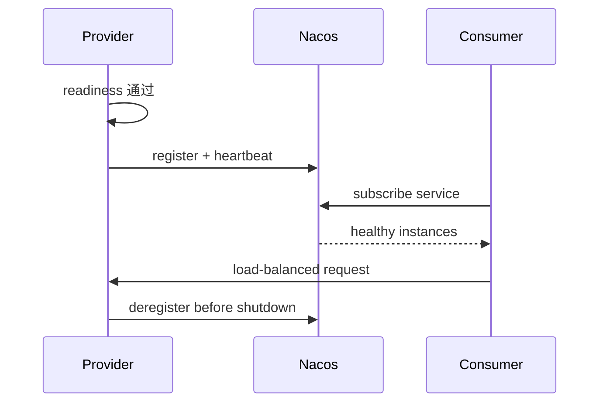

# Nacos：服务注册、发现、健康检查与配置治理

注册中心解决实例寻址，配置中心管理动态配置；两者都需要命名空间、权限、版本和故障策略。

## 1. 本文覆盖范围

- 实例与服务模型
- 健康检查与负载均衡
- 配置发布与回滚
- 多环境、权限和容灾

## 2. 核心知识详解

### 1. 服务与实例

服务名、group、namespace、cluster 和实例元数据共同决定注册和查询范围。临时/持久实例在故障感知与存储语义上不同。

- 服务标识包含应用、环境和接口版本，避免同名污染。
- 实例地址通过平台注入，不写死宿主机地址。
- 上下线、优雅停机和注册撤销纳入发布流程。

**正确性边界：** 注册成功只表示控制面记录存在，不证明业务端点已经 ready。

### 2. 健康与路由

客户端/服务端通过心跳、主动探测或连接状态识别实例，消费者结合权重、区域和健康列表选择目标。

- readiness 成功后再接流量，停机先摘流再等待请求结束。
- 本地缓存保证注册中心短故障时继续使用已知实例。
- 故障实例剔除速度与误判风险平衡。

**正确性边界：** 健康检查频率越高并不总更可靠；网络抖动可能造成频繁摘挂和负载震荡。

### 3. 配置版本与发布

配置由 dataId/group/namespace 定位，变更需要校验、灰度、审计、回滚和消费确认。应用收到新值后还要验证语义。

- 敏感值使用专用密钥系统，不以普通明文配置传播。
- 配置对象绑定、范围和刷新边界可测试。
- 破坏性配置通过双读/双配置窗口演进。

**正确性边界：** 动态刷新不是事务；多个实例看到新配置的时间可能不同，业务逻辑应容忍短暂混合版本。

### 4. 容灾和权限

Nacos 集群本身也会故障。客户端缓存、超时、限流和降级定义控制面不可用时的数据面行为。

- 最小权限区分发布者、读取者与运维者。
- 备份命名空间、配置与数据库，定期演练恢复。
- 监控推送延迟、失败、实例数异常和客户端版本。

**正确性边界：** 把注册中心做成所有请求的同步依赖会使控制面故障直接扩大为数据面故障。

## 3. 工程链路

## 4. 实践与验证

1. 建立 dev/test/prod 命名空间和最小权限。
2. 模拟 Nacos 短时不可用，验证消费者本地缓存。
3. 发布一个动态限流配置并演练校验、灰度和回滚。

## 5. 掌握检查

- [ ] 能区分注册与 readiness。
- [ ] 能设计实例优雅下线。
- [ ] 能治理动态配置。
- [ ] 能说明控制面故障策略。

## 参考资料

- [Nacos Documentation](https://nacos.io/en/docs/latest/)
- [Spring Cloud Alibaba Nacos](https://sca.aliyun.com/en/docs/2023/user-guide/nacos/quick-start/)
