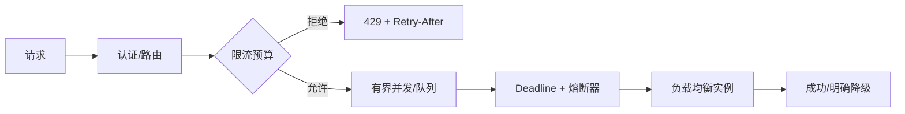

# API 网关、负载均衡、限流、熔断、降级与重试

流量治理的目标是保护系统并给调用方可预测语义；每个机制都需要范围、预算、观测和恢复条件。

## 1. 本文覆盖范围

- L4/L7 与网关职责
- 负载均衡与健康
- 限流和排队
- 超时、重试、熔断与降级

## 2. 核心知识详解

### 1. 网关职责边界

网关负责路由、TLS 终止、认证入口、限流、协议适配和观测等通用能力；核心业务规则留在领域服务。

- 路由配置版本化，发布前检测冲突和不可达后端。
- 请求体大小、header、上传和连接限制显式设置。
- 网关故障域与容量独立规划，避免单点。

**正确性边界：** 把业务编排全部塞入网关会形成难测试、难扩展的新单体。

### 2. 负载均衡

轮询、最少连接、加权、EWMA、哈希等算法适合不同负载；健康检查和 outlier detection 决定候选集合。

- 长请求/流式连接关注活动负载而非仅请求数。
- 一致性哈希减少扩缩容时映射变化，但不替代副本。
- 客户端负载均衡需及时获得实例变化和区域信息。

**正确性边界：** 会话黏性隐藏状态问题且削弱均衡；确有需求时仍需故障迁移方案。

### 3. 限流、排队与背压

令牌桶允许可控突发，漏桶平滑输出，固定/滑动窗口按时间计数。限流维度可按租户、接口、来源和全局资源组合。

- 返回明确状态和 Retry-After，区分配额与过载。
- 队列必须有界，设置最大等待和丢弃/拒绝策略。
- 下游容量变化通过自适应或配置更新反映。

**正确性边界：** 排队不创造容量；无界排队会把拒绝转成超时、内存增长和过期工作。

### 4. 超时、重试、熔断和降级

deadline 限制端到端时间；熔断器按失败/慢调用打开并在半开状态探测恢复；降级返回明确的次优结果。

- 每层超时小于上层剩余预算，并保留处理响应的时间。
- 只重试幂等或带幂等键操作，使用退避抖动和 retry budget。
- 降级结果标识新鲜度与完整性，禁止把伪造成功当真实成功。

**正确性边界：** 熔断器按依赖和操作隔离；全局一个熔断器会让无关功能互相拖累。

## 3. 工程链路

## 4. 实践与验证

1. 为读接口设计 token bucket 和 429 契约。
2. 模拟单实例慢调用，验证 outlier、熔断和恢复。
3. 计算三层调用链的 deadline 与 retry budget。

## 5. 掌握检查

- [ ] 能区分限流和排队。
- [ ] 能传播 deadline。
- [ ] 能避免重试放大。
- [ ] 能定义诚实的降级语义。

## 参考资料

- [Spring Cloud Gateway](https://docs.spring.io/spring-cloud-gateway/reference/)
- [Resilience4j](https://resilience4j.readme.io/docs)
- [Envoy Load Balancing](https://www.envoyproxy.io/docs/envoy/latest/intro/arch_overview/upstream/load_balancing/overview)
