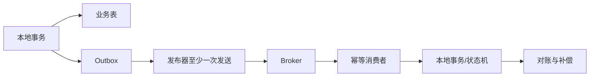

# 分布式 ID、分布式事务、Outbox、Saga 与可靠事件

跨服务一致性先定义业务不变量与失败补偿，再在本地事务、幂等和事件之间选择最小机制。

## 1. 本文覆盖范围

- ID 生成
- 两阶段提交边界
- Transactional Outbox
- Saga、幂等和对账

## 2. 核心知识详解

### 1. 分布式 ID

数据库序列/自增、号段、UUID/ULID 和 Snowflake 类算法在排序、索引局部性、中心依赖和时钟上权衡。

- 外部公开 ID 避免暴露业务量，可与内部主键分离。
- Snowflake 类方案必须治理 worker id、时钟回拨和位宽寿命。
- ID 唯一不等于请求幂等；重试仍需业务幂等键。

**正确性边界：** 按时间大致有序的 ID 不是严格业务顺序，也不应作为全局时钟。

### 2. 原子提交协议

XA/2PC 通过协调器和参与者 prepare/commit 获得原子性，但有锁持有、协调和可用性代价；适合边界明确且基础设施支持的场景。

- 先评估能否重新划分聚合，在单库事务中维护核心不变量。
- 超时后查询事务状态，参与者恢复流程可演练。
- 不要用分布式锁代替事务原子性。

**正确性边界：** 2PC 保证的范围取决于参与资源和实现，并不包含未参与的外部 HTTP 副作用。

### 3. Transactional Outbox

业务数据和 outbox 事件在同一本地事务写入，独立发布器把事件发送到 broker；消费者按 event id 幂等处理。

- 事件包含 schema version、aggregate id、sequence 和 trace context。
- 发布至少一次，因此消费者去重与可重入是必要设计。
- 监控未发布积压、失败次数和端到端事件延迟。

**正确性边界：** Outbox 解决数据库与事件记录的原子性，不保证 broker 和所有消费者恰好一次。

### 4. Saga 与对账

Saga 把长事务拆为本地事务序列，通过编排器或事件协同推进，失败时执行语义补偿。补偿不是数据库回滚，而是新的业务操作。

- 状态机记录每步、重试、补偿和人工介入。
- 预留资源设置过期时间，补偿可重复执行。
- 定期对账发现未达最终状态和跨系统差异。

**正确性边界：** 某些副作用不可逆；设计时需设置确认点、人工流程或风险准备金。

## 3. 工程链路

## 4. 实践与验证

1. 实现订单表与 outbox 同事务写入并模拟发布器崩溃重启。
2. 为消费者设计去重表和可重入更新。
3. 画出支付失败、库存释放和补偿失败的 Saga 状态机。

## 5. 掌握检查

- [ ] 能区分唯一 ID 与幂等键。
- [ ] 能说明 2PC 适用边界。
- [ ] 能实现 Outbox。
- [ ] 能为不可逆步骤设计对账。

## 参考资料

- [Transactional Outbox Pattern](https://microservices.io/patterns/data/transactional-outbox.html)
- [Saga Pattern](https://microservices.io/patterns/data/saga.html)
- [RFC 9562 UUID](https://www.rfc-editor.org/rfc/rfc9562.html)
