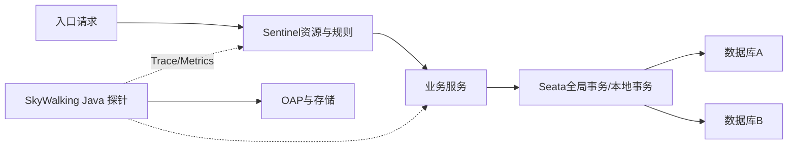

# Seata、Sentinel 与 SkyWalking 实战边界

这三个组件分别聚焦分布式事务、流量治理与可观测性。它们解决的是不同问题：事务一致性、过载保护和运行证据不能相互替代。

## 1. 学习目标

- 比较 Seata AT/TCC/Saga/XA
- 理解 Sentinel 资源、规则和降级
- 理解 SkyWalking 探针、后端与存储链路

## 2. 核心概念

### 1. Seata 模式选择

AT 通过数据源代理、undo log 和全局锁协调关系数据库；TCC 要求业务实现 Try/Confirm/Cancel；Saga 用一系列本地事务与补偿处理长流程；XA 依赖数据库 XA 能力。

**正确边界：** 任何模式都需处理空回滚、悬挂、幂等、补偿失败和协调器可用性。

### 2. Sentinel 流量治理

Sentinel 把调用路径或业务操作定义为资源，按 QPS、并发线程、关联/链路等规则限流，并基于慢调用或异常熔断。规则应通过控制面持久化并灰度发布。

**正确边界：** 限流阈值需由容量测试和 SLO 得出；复制示例数值会造成误拒绝或过载。

### 3. SkyWalking 可观测链路

探针采集 trace/metric/profile 数据，OAP 聚合分析并写入存储，UI 用于查询。服务名、实例名、采样、保留期和敏感数据策略需统一。

**正确边界：** 追踪展示调用相关性，不自动证明根因；仍要结合日志、指标、变更和代码。

### 4. 组合使用

trace 可识别慢依赖，容量证据形成 Sentinel 规则；事务链路用 trace 关联 Seata XID；规则变更和事务补偿都写审计与业务指标。

**正确边界：** 观测组件失效不应阻塞主业务；治理控制面也需要降级策略。

## 3. 运行链路



## 4. 最小示例

```java
try (Entry entry = SphU.entry("order.create")) {
  return orderService.create(command);
} catch (BlockException blocked) {
  throw new TooManyRequestsException("系统繁忙，请稍后重试");
}
```

## 5. 练习与验证

1. 对 AT 模式制造二阶段失败并观察补偿
2. 用阶梯压测确定 Sentinel 阈值
3. 从 trace 定位一次慢 SQL 并用数据库证据交叉验证

## 6. 常见误区

- 把分布式事务当成本地事务无成本放大
- 熔断后的 fallback 返回伪造成功
- 采集全部 trace 却未估算存储与敏感字段

## 7. 掌握检查

- [ ] 能不用术语堆砌，向初学者解释本主题解决的问题。
- [ ] 能运行示例并观察正常、边界和失败分支。
- [ ] 能说明该能力在完整 Java 后端链路中的位置和替换边界。
- [ ] 能以测试、执行计划、指标或规范条款验证关键结论。

## 参考资料

- [Seata Documentation](https://seata.apache.org/docs/)
- [Sentinel Documentation](https://sentinelguard.io/en-us/docs/introduction.html)
- [Apache SkyWalking](https://skywalking.apache.org/docs/)
