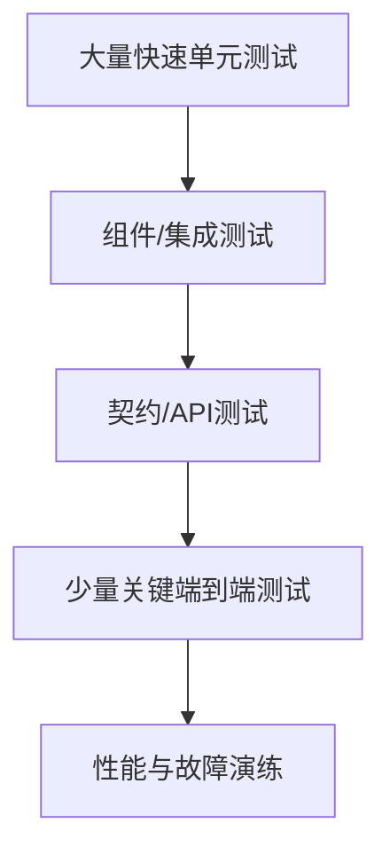

# 测试与质量工程：从零开始的阶段导学

> 这一页是本阶段的入口，不假设读者已经接触过对应框架。先建立“为什么需要它、它在链路中的位置、如何验证”的心智模型，再进入各专题。

## 1. 本阶段解决什么问题

用不同层级的可执行证据降低变更风险。单元测试快速验证局部规则；集成测试验证真实边界；契约与端到端测试验证协作；性能和稳定性测试验证非功能目标。

### 前置知识

- 会写 Java 方法与异常处理
- 理解构建生命周期和 Git 协作

## 2. 零基础词汇与心智模型

### 1. 测试替身

stub 提供预设输入，fake 提供简化实现，mock 验证交互；替身类型应由测试目的决定。

**学会的证据：** 能优先断言可观察结果而非内部调用细节。

### 2. 测试隔离

测试应能独立、可重复运行，不依赖执行顺序、共享可变数据或真实时钟。

**学会的证据：** 能使用固定时钟、临时目录和独立数据库。

### 3. 集成测试

集成测试验证数据库、消息、HTTP 或框架配置的真实协作。Testcontainers 可启动接近生产的短生命周期依赖。

**学会的证据：** 能验证真实迁移、约束和序列化。

### 4. 质量门禁

门禁把编译、测试、静态检查、安全扫描和覆盖策略放入 CI；覆盖率只是信号，不证明断言质量。

**学会的证据：** 能让失败证据可定位且构建可重复。

## 3. 建议学习顺序

1. 先测试纯领域规则
2. 再测试数据库和框架边界
3. 加入 API/契约与少量关键 E2E
4. 最后做性能、故障与发布验证

## 4. 完整链路



## 5. 最小代码切片

```java
@Test
void amountMustBePositive() {
  assertThrows(IllegalArgumentException.class, () -> new Money("-0.01"));
}
```

## 6. 第一个可验证练习

为转账规则写单元测试，为数据库仓库写 Testcontainers 集成测试，为 REST 接口写契约测试；故意改变字段类型，确认哪一层最先给出清晰失败。

## 7. 初学者容易混淆的边界

- 只 mock 自己不理解的框架会得到脆弱测试
- 用生产共享环境做所有测试会导致不稳定
- 追求 100% 覆盖率可能挤压有效边界测试

## 8. 阶段验收

- [ ] 能选择测试层级
- [ ] 能控制时间和外部依赖
- [ ] 能从失败日志快速定位原因

## 参考资料

- [JUnit User Guide](https://docs.junit.org/current/user-guide/)
- [Testcontainers for Java](https://java.testcontainers.org/)
- [Spring Testing](https://docs.spring.io/spring-framework/reference/testing.html)
