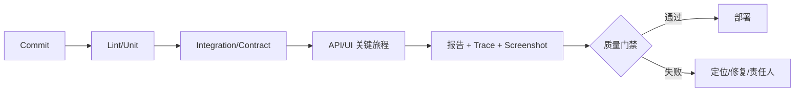

# API、UI 自动化与持续质量平台

自动化测试需要稳定定位、独立数据、并行能力、失败证据和责任闭环，脚本数量本身不代表质量。

## 1. 本文覆盖范围

- API schema 与场景测试
- Playwright/Selenium/Cypress 思路
- 数据与环境
- CI 报告、flaky 治理和质量门禁

## 2. 核心知识详解

### 1. API 测试

接口测试覆盖认证、参数、业务状态机、幂等、并发、错误码和 schema，而不仅是状态 200。

- OpenAPI schema 校验与业务断言并用。
- 测试创建自己的数据，并通过 API/受控 fixture 清理。
- 记录 request id、trace id 和关键响应供定位。

**正确性边界：** 只对整段 JSON 快照容易产生噪声并遗漏语义；关键字段用明确断言。

### 2. UI 自动化

UI 测试以用户可见角色、标签和稳定测试标识定位，等待可观察状态，不依赖 DOM 层级和固定 sleep。

- Page Object/组件对象封装业务动作而非每个元素。
- 浏览器上下文隔离账号、cookie 和存储。
- 失败保存截图、trace、视频、网络和控制台。

**正确性边界：** CSS/XPath 长路径紧耦合实现，页面小改动会造成大量无业务意义失败。

### 3. 环境和数据

测试环境以 IaC/容器可重复创建，外部依赖使用 sandbox、契约 stub 或受控真实环境。

- 数据用唯一前缀和租户隔离，支持并行。
- 时区、语言、网络慢速和移动尺寸纳入场景。
- 测试密钥单独管理且权限最小。

**正确性边界：** 共享不可重置环境会产生顺序依赖和假阳性，优先建设可创建的环境。

### 4. 持续质量平台

CI 按变更风险运行 lint、单元、集成、契约、E2E、安全与性能子集，结果聚合到可追踪报告。

- flaky 记录所有者、频率和修复期限，不静默无限重跑。
- 质量门禁基于关键测试和风险，不仅覆盖率阈值。
- 测试失败可关联代码、环境、日志和工单。

**正确性边界：** 把 flaky 测试永久 quarantine 会逐步失去保护；隔离只是有期限的修复阶段。

## 3. 工程链路



## 4. 最小可运行示例

下面的示例只保留关键路径。把它放入对应版本的最小工程，先运行测试或命令确认行为，再逐步加入重试、超时、监控和异常分支。

```typescript
import { test, expect } from '@playwright/test'

test('管理员可创建订单', async ({ page }) => {
  await page.goto('/orders/new')
  await page.getByLabel('客户编号').fill('C-001')
  await page.getByRole('button', { name: '创建' }).click()
  await expect(page.getByText('创建成功')).toBeVisible()
})
```

## 5. 实践与验证

1. 用 Playwright Java 自动化登录、创建订单和权限拒绝。
2. 构造并行 API 测试数据并证明互不污染。
3. 建立 flaky 指标和一条有期限的治理规则。

## 6. 掌握检查

- [ ] 能写语义 API 断言。
- [ ] 能使用稳定 UI locator。
- [ ] 能隔离环境数据。
- [ ] 能治理 flaky 而非隐藏。

## 参考资料

- [Playwright Java](https://playwright.dev/java/)
- [Selenium Documentation](https://www.selenium.dev/documentation/)
- [Cypress Documentation](https://docs.cypress.io/)
