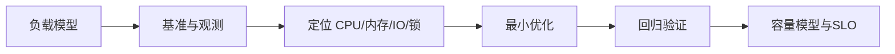

# 高性能与消息队列：从零开始的阶段导学

> 这一页是本阶段的入口，不假设读者已经接触过对应框架。先建立“为什么需要它、它在链路中的位置、如何验证”的心智模型，再进入各专题。

## 1. 本阶段解决什么问题

以测量为起点改善吞吐、延迟和资源效率，并用消息队列解耦峰值与处理节奏。性能优化不是替换名词；必须定义负载、基线、瓶颈、变更和回归。

### 前置知识

- 理解 JVM 并发、数据库索引和 HTTP
- 会编写可重复自动化测试

## 2. 零基础词汇与心智模型

### 1. 吞吐与延迟

吞吐是单位时间完成量，延迟是单次耗时分布；平均值会隐藏长尾，通常观察 p50/p95/p99。

**学会的证据：** 能在固定并发和数据集下报告分位数与错误率。

### 2. 排队

到达速率接近服务能力时，队列与等待时间会快速增长；异步只移动等待位置，不创造算力。

**学会的证据：** 能同时观测队列深度、消费速率和积压年龄。

### 3. 至少一次投递

消息系统常通过重投保证不轻易丢消息，因此消费者必须预期重复。

**学会的证据：** 能用业务幂等键或去重表处理重复。

### 4. 背压

下游饱和时，上游需要限速、拒绝、降级或排队上限，否则内存和延迟会失控。

**学会的证据：** 能定义队列容量与过载策略。

## 3. 建议学习顺序

1. 建立负载模型和基线
2. 使用 JFR/指标定位瓶颈
3. 学习可靠消息语义与幂等消费
4. 再做缓存、分片和热点治理

## 4. 完整链路



## 5. 最小代码切片

```java
Timer.Sample sample = Timer.start(registry);
try { return service.handle(command); }
finally { sample.stop(registry.timer("orders.handle")); }
```

## 6. 第一个可验证练习

对一个数据库写接口进行阶梯加压，记录吞吐、p95、错误率、连接池等待和 GC；加入消息队列削峰后，再报告端到端完成延迟，而非只报告接口接收延迟。

## 7. 初学者容易混淆的边界

- 微基准结果不能直接代表完整服务
- 发送成功不等于业务消费成功
- 缓存命中率高也可能存在热点键与尾延迟

## 8. 阶段验收

- [ ] 能读基本 JFR 证据
- [ ] 能说明消息确认与重投
- [ ] 能用数据验证优化而非凭感觉

## 参考资料

- [Java Flight Recorder](https://docs.oracle.com/en/java/javase/25/jfapi/)
- [Kafka Documentation](https://kafka.apache.org/documentation/)
- [RabbitMQ Tutorials](https://www.rabbitmq.com/tutorials)
