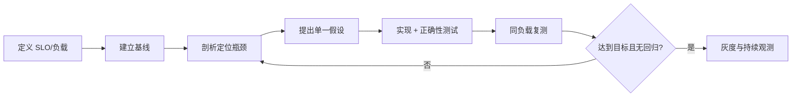

# 性能工程：容量、基准、剖析与 JVM 诊断

优化目标应是可度量的吞吐、延迟分位数、资源与成本，而不是抽象的“更快”。

## 1. 本文覆盖范围

- SLO 与容量模型
- 正确基准测试
- CPU/内存/锁/IO 剖析
- JFR、jcmd、GC 日志与压测闭环

## 2. 核心知识详解

### 1. 预算与排队

吞吐、并发与平均响应时间可用 Little 定律在稳定系统中关联。端到端延迟预算分配给网关、排队、服务、数据库和网络。

- 使用 p50/p95/p99 和错误率，不只看平均值。
- 容量测试逐步升压，识别饱和点和拐点。
- 稳态、突发、故障和恢复分别验证。

**正确性边界：** Little 定律要求稳定长期平均；系统积压持续增长时直接套用会误导。

### 2. 基准测试方法

JVM 有 JIT、逃逸分析、GC 和预热，微基准使用 JMH 避免死代码消除、常量折叠和错误计时。

- 端到端压测与微基准回答不同问题。
- 固定数据、环境、版本和负载生成器容量。
- 报告置信区间、样本和火焰图证据。

**正确性边界：** 一次 `System.nanoTime` 循环不是可靠 JVM 微基准。

### 3. 证据驱动剖析

CPU profile 找热点，allocation profile 找分配，heap dump 找保留路径，线程转储找阻塞，GC 日志解释暂停与堆行为。

- 先复现并建立基线，再改一个变量。
- 区分 CPU 饱和、锁等待、IO 等待和下游排队。
- 生产优先低开销 JFR，敏感数据采集有权限和留存控制。

**正确性边界：** 对象数量多不等于泄漏；从 GC Roots 的意外保留路径才是关键证据。

### 4. 优化与验证

优化顺序通常是删除不必要工作、改算法/查询、批量与缓存、减少分配/锁，最后才微调 JVM 参数。

- 每次优化验证正确性和尾延迟。
- GC 选择依据堆、暂停目标和吞吐。
- 变更设回滚阈值和线上观测。

**正确性边界：** 增加堆可能减少 GC 频率，也可能增加内存成本和故障转储时间；需要测量。

## 3. 工程链路

## 4. 实践与验证

1. 用 JMH 比较两种集合查找，解释预热和 Blackhole。
2. 对一个接口采集 JFR 并区分 CPU、锁与分配热点。
3. 写出峰值、实例数、连接池和数据库容量表。

## 5. 掌握检查

- [ ] 能使用分位数和饱和点。
- [ ] 能写可信 JMH。
- [ ] 能读基础 JFR/线程/堆证据。
- [ ] 能验证优化收益与回归。

## 参考资料

- [JMH](https://openjdk.org/projects/code-tools/jmh/)
- [Java Flight Recorder](https://docs.oracle.com/en/java/javase/26/jfapi/)
- [jcmd](https://docs.oracle.com/en/java/javase/26/docs/specs/man/jcmd.html)
