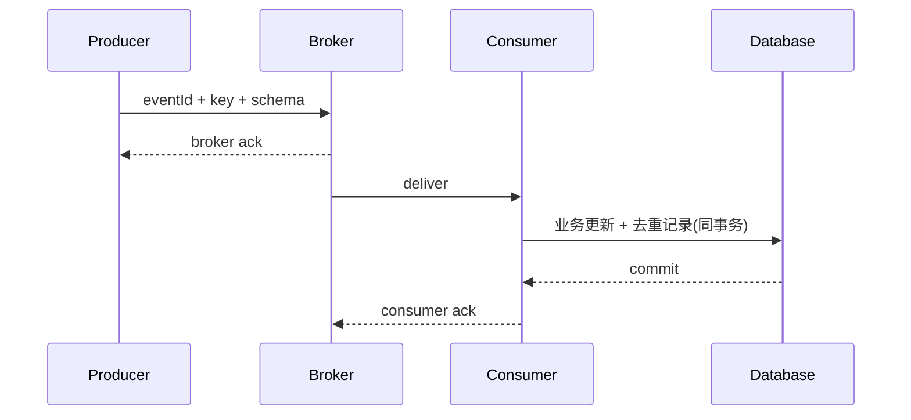

# 消息队列基础：交付、顺序、幂等、积压与死信

消息系统在生产者、broker 和消费者之间引入异步边界；可靠性来自协议、持久化、确认、幂等和运维共同作用。

## 1. 本文覆盖范围

- 消息模型与分区/队列
- 至少一次与幂等
- 顺序、重试和死信
- 积压、回压和模式演进

## 2. 核心知识详解

### 1. 投递链路与确认

生产确认表示 broker 已按配置接收，不代表消费者完成业务。消费者先处理后确认可减少丢失，但崩溃会重投。

- 生产端设置 id、key、schema version 和 trace。
- broker 副本、持久化和确认级别按损失预算选择。
- 消费确认只在本地事务成功后发送。

**正确性边界：** 所谓“发送成功”必须说明成功到哪一层、在何种副本/落盘配置下。

### 2. 至少一次与幂等

常见端到端语义是至少一次，因此消费者以 event id 或业务幂等键去重，并把去重记录与业务更新放在同一本地事务。

- 去重表设置唯一约束与合理保留期。
- 更新可用状态机条件或 compare-and-set。
- 外部副作用使用供应方幂等接口或内部 outbox。

**正确性边界：** 框架的 exactly-once 通常限定于特定 broker 读写事务，不自动涵盖任意数据库和 HTTP 服务。

### 3. 顺序与失败处理

顺序通常只在队列/分区内成立。选择业务 key 让同一聚合进入同一分区，并用序列号拒绝旧事件。

- 重试主题/队列采用退避，避免毒消息阻塞主队列。
- 死信包含原消息、错误、次数和可重放信息。
- 人工修复与 replay 需要审计和幂等。

**正确性边界：** 全局顺序显著限制并行度；业务多半只需要单实体顺序。

### 4. 积压与模式演进

消费者速率低于生产速率会积压。监控 lag、最老消息年龄、失败率和处理耗时，并规划扩容、暂停或丢弃策略。

- 消息 schema 采用兼容演进和消费者驱动验证。
- 大 payload 存对象存储，消息只传引用和校验信息。
- 设置 TTL 前确认过期语义和审计需求。

**正确性边界：** 只增加消费者数受分区数、下游容量和 key 热点限制。

## 3. 工程链路

## 4. 实践与验证

1. 模拟消费者提交数据库后、发送 ack 前崩溃，验证去重。
2. 设计毒消息的退避、死信、修复与重放流程。
3. 为订单事件定义兼容 schema 和分区 key。

## 5. 掌握检查

- [ ] 能描述确认边界。
- [ ] 能实现幂等消费。
- [ ] 能限定顺序范围。
- [ ] 能治理积压和 replay。

## 参考资料

- [Apache Kafka Documentation](https://kafka.apache.org/documentation/)
- [RabbitMQ Documentation](https://www.rabbitmq.com/docs)
- [Apache RocketMQ Concepts](https://rocketmq.apache.org/docs/introduction/02concepts/)
