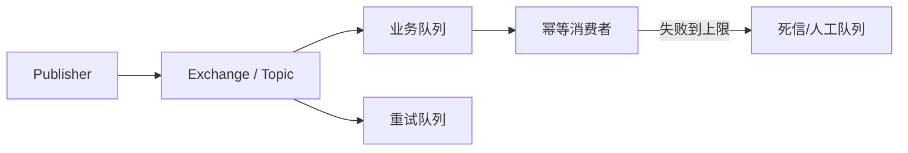

# RabbitMQ 与 RocketMQ：路由、队列、可靠性和选择

RabbitMQ 擅长灵活 AMQP 路由和工作队列；RocketMQ 面向大规模消息与事务/延时等业务能力。选择应基于语义和运维证据。

## 1. 本文覆盖范围

- RabbitMQ exchange/binding/queue
- publisher confirms 与 consumer ack
- quorum queue 与死信
- RocketMQ topic、consumer group 与事务消息

## 2. 核心知识详解

### 1. RabbitMQ 路由模型

producer 发布到 exchange，exchange 按 direct/topic/fanout/headers 规则路由到 binding queue；消费者从队列取消息。

- exchange/queue 声明需兼容，durable 与消息持久化分别配置。
- prefetch 限制未确认消息并形成消费者背压。
- mandatory/alternate exchange 处理不可路由消息。

**正确性边界：** 消息成功到 exchange 不表示一定进入预期队列；需处理 unroutable 反馈。

### 2. RabbitMQ 可靠性

publisher confirms、持久消息、持久/quorum queue 和 consumer ack 共同建立链路。quorum queue 基于 Raft 复制，适合需要数据安全的队列。

- 确认使用异步批量关联，避免逐条同步等待。
- consumer nack/requeue 设置次数和退避，避免忙循环。
- 监控 ready/unacked、内存/磁盘告警和节点分区。

**正确性边界：** 镜像/副本不会修复消费者非幂等，也不会保证外部数据库原子提交。

### 3. 死信与延时

TTL、拒绝、队列长度等可触发 dead-letter；死信交换把消息转入重试或人工队列。延时策略需关注排序、容量和过期扫描。

- 死信原因、原始 routing key、重试次数写入可审计 header。
- 重试队列按等级设置，不无限自循环。
- 最终失败进入人工可查询状态。

**正确性边界：** 死信转发本身也可能失败，配置和监控必须覆盖目标交换机/队列。

### 4. RocketMQ 语义与选择

RocketMQ 以 topic、message queue、producer/consumer group 组织消息，并提供顺序、延时和事务消息等能力；事务消息通过半消息和回查连接本地事务状态。

- 事务回查实现幂等并能从持久状态判断。
- 顺序范围由 message group/queue 决定。
- 按团队运维能力、生态、延迟与功能验证选型。

**正确性边界：** 事务消息仍需要消费者幂等，并且本地事务状态查询必须可靠。

## 3. 工程链路



## 4. 最小可运行示例

下面的示例只保留关键路径。把它放入对应版本的最小工程，先运行测试或命令确认行为，再逐步加入重试、超时、监控和异常分支。

```java
rabbitTemplate.convertAndSend("orders.exchange", "orders.created", event,
    message -> {
      message.getMessageProperties().setMessageId(event.eventId().toString());
      message.getMessageProperties().setDeliveryMode(MessageDeliveryMode.PERSISTENT);
      return message;
    });
```

## 5. 实践与验证

1. 搭建 RabbitMQ topic exchange，验证不可路由消息与 publisher confirm。
2. 模拟 consumer nack/requeue，修复为有界退避和死信。
3. 为订单事务消息写状态回查决策表。

## 6. 掌握检查

- [ ] 能解释 exchange 与 queue。
- [ ] 能组合 confirms/acks/持久化。
- [ ] 能治理死信。
- [ ] 能按语义选择 broker。

## 参考资料

- [RabbitMQ Documentation](https://www.rabbitmq.com/docs)
- [RabbitMQ Quorum Queues](https://www.rabbitmq.com/docs/quorum-queues)
- [Apache RocketMQ Concepts](https://rocketmq.apache.org/docs/introduction/02concepts/)
