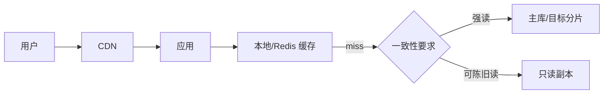

# 缓存、CDN、读写分离、分库分表与热点治理

扩展数据路径应先优化模型、索引和缓存，再引入复制或分片；每一层都增加一致性和运维成本。

## 1. 本文覆盖范围

- 多级缓存与失效
- CDN 与边缘缓存
- 读写分离
- 分片、全局查询与热点

## 2. 核心知识详解

### 1. 缓存策略

cache-aside 由应用读缓存、miss 查库并回填，写入通常先提交数据库再失效缓存。TTL、版本和事件失效共同限制陈旧窗口。

- 空值缓存/布隆过滤器防穿透。
- 互斥回填、逻辑过期或请求合并防击穿。
- 随机 TTL、容量策略与预热防雪崩。

**正确性边界：** 删除缓存失败仍会陈旧；关键数据需要重试、事件或版本校验，不能声称强一致。

### 2. CDN 与 HTTP 缓存

CDN 依据 URL、header 和缓存键在边缘保存静态或可缓存响应。Cache-Control、ETag、Vary 和 purge 决定新鲜度。

- 缓存键必须包含影响内容的租户/语言等维度。
- 私有响应与认证 header 默认不进入共享缓存。
- 资源使用内容哈希 URL，HTML 使用短 TTL/重验证。

**正确性边界：** CDN purge 有传播延迟，敏感撤回需要短 TTL、版本 URL 或边缘鉴权配合。

### 3. 读写分离

写入主库、读取副本可扩展读，但复制延迟会破坏 read-your-writes。路由需按一致性要求而非接口名称决定。

- 写后短时间读主库或携带复制位置。
- 副本 lag 超阈值摘除，报表与在线流量隔离。
- 故障切换防脑裂并验证数据点。

**正确性边界：** 读副本不是无成本容量，长查询仍会占 IO/缓存并影响复制。

### 4. 分片与热点

分片键决定数据分布、查询路由和扩容成本。范围、哈希、目录和一致性哈希各有权衡。

- 优先让高频操作单分片完成。
- 全局唯一约束、跨分片事务和排序需单独设计。
- 热点 key 可拆分、局部缓存或隔离，但合并语义必须正确。

**正确性边界：** 分库分表不会自动提升单条复杂 SQL，且会把 JOIN、事务、迁移和查询复杂度移到应用/中间件。

## 3. 工程链路



## 4. 最小可运行示例

下面的示例只保留关键路径。把它放入对应版本的最小工程，先运行测试或命令确认行为，再逐步加入重试、超时、监控和异常分支。

```http
GET /assets/app.3f82a1.js HTTP/1.1
Host: static.example.com

HTTP/1.1 200 OK
Cache-Control: public, max-age=31536000, immutable
ETag: "3f82a1"
```

## 5. 实践与验证

1. 设计用户资料的缓存键、TTL、失效失败和写后读策略。
2. 为一个多租户订单表比较两种分片键。
3. 演练副本 lag 和热点 key，记录保护动作。

## 6. 掌握检查

- [ ] 能说明缓存陈旧窗口。
- [ ] 能正确配置共享缓存键。
- [ ] 能处理写后读。
- [ ] 能分析分片代价。

## 参考资料

- [Redis Caching](https://redis.io/docs/latest/develop/use/)
- [MDN HTTP Caching](https://developer.mozilla.org/en-US/docs/Web/HTTP/Caching)
- [MySQL Replication](https://dev.mysql.com/doc/refman/8.4/en/replication.html)
