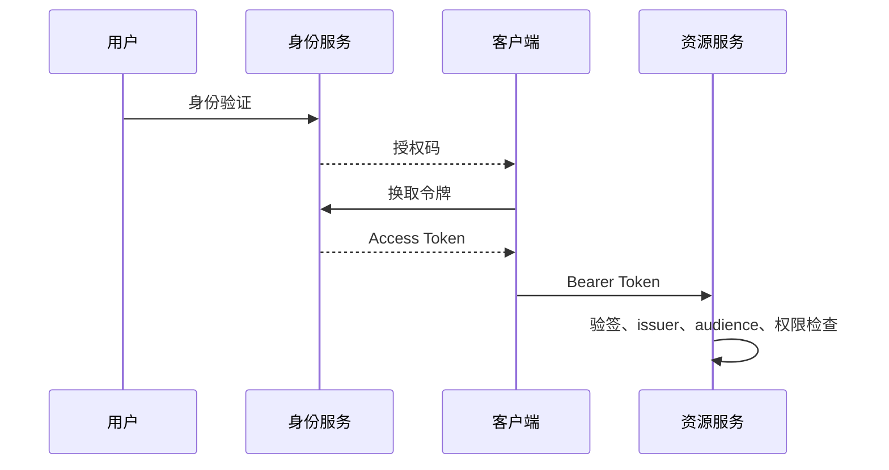

# 安全、认证与授权：从零开始的阶段导学

> 这一页是本阶段的入口，不假设读者已经接触过对应框架。先建立“为什么需要它、它在链路中的位置、如何验证”的心智模型，再进入各专题。

## 1. 本阶段解决什么问题

建立从身份、会话、权限到输入输出、秘密、依赖和审计的分层安全模型。认证回答“是谁”，授权回答“允许做什么”；两者都应在可信服务端执行。

### 前置知识

- 理解 HTTP cookie、header、TLS 与服务端会话
- 能编写 Spring MVC 接口和数据库查询

## 2. 零基础词汇与心智模型

### 1. 认证

认证校验主体身份，可基于密码、多因素、会话或外部身份提供方。密码应使用专用慢哈希并采用合适参数。

**学会的证据：** 能实现登录失败限速与会话失效。

### 2. 授权

授权依据主体、资源、动作与上下文做决策；仅隐藏前端按钮不构成授权。

**学会的证据：** 能在方法/资源层验证对象归属。

### 3. OAuth 2.0 与 OIDC

OAuth 2.0 是委托授权框架；OIDC 在其上定义身份层和 ID Token。Access Token 的受众是资源服务器。

**学会的证据：** 能区分授权码、ID Token 与 Access Token。

### 4. 纵深防御

校验、编码、最小权限、秘密管理、依赖治理、审计和监控相互补充，单一过滤器不足以覆盖完整风险。

**学会的证据：** 能用威胁模型列出资产、信任边界和滥用途径。

## 3. 建议学习顺序

1. 先理解会话认证与密码存储
2. 学习 URL/方法/对象级授权
3. 再学习 OAuth2/OIDC/JWT
4. 最后覆盖输入、秘密、供应链与审计

## 4. 完整链路



## 5. 最小代码切片

```java
@PreAuthorize("hasRole('ADMIN') or #ownerId == authentication.name")
public OrderView find(String ownerId, long orderId) { return repository.require(orderId); }
```

## 6. 第一个可验证练习

实现“用户只能查看自己的订单、管理员可查看全部订单”，覆盖匿名、普通用户越权、过期会话与管理员成功四类测试。

## 7. 初学者容易混淆的边界

- JWT 签名不等于内容保密
- CORS 不是服务端授权机制
- CSRF 与 XSS 的攻击条件和防护重点不同

## 8. 阶段验收

- [ ] 能区分认证与授权
- [ ] 能校验令牌 issuer/audience/expiry
- [ ] 能进行资源级授权测试

## 参考资料

- [Spring Security Reference](https://docs.spring.io/spring-security/reference/)
- [OAuth 2.0 Security Best Current Practice](https://www.rfc-editor.org/rfc/rfc9700)
- [OWASP ASVS](https://owasp.org/www-project-application-security-verification-standard/)
