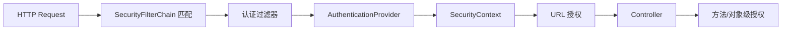

# Spring Security：过滤链、认证、授权与方法安全

Spring Security 在 Servlet 应用中通过 SecurityFilterChain 建立安全上下文，并在请求与方法边界执行认证和授权。

## 1. 本文覆盖范围

- 过滤链与 SecurityContext
- AuthenticationProvider
- 请求与方法授权
- 密码、会话与审计

## 2. 核心知识详解

### 1. 过滤链和上下文

请求先匹配一条 `SecurityFilterChain`，过滤器按顺序处理上下文加载、认证机制、异常转换和授权。上下文默认与当前请求线程关联。

- 多条 chain 的 matcher 从专用到通用排列。
- 异步任务显式传播最小身份信息。
- 拒绝响应区分未认证 401 与权限不足 403。

**正确性边界：** 自己插入 filter 时顺序错误会绕过或重复处理；优先使用框架 DSL 和标准扩展点。

### 2. 认证提供者

AuthenticationManager 把凭据交给匹配的 AuthenticationProvider；成功后返回已认证主体与 authorities。密码以自适应单向哈希保存。

- BCrypt/Argon2 等参数随硬件和风险升级。
- 登录失败信息避免账号枚举，同时保留内部审计原因。
- MFA、设备和风险策略属于更高层认证流程。

**正确性边界：** 加密密码后可解密与密码哈希是不同方案；服务端保存的是不可逆验证值。

### 3. 授权模型

请求授权保护 URL，方法授权保护服务操作；RBAC 易管理，ABAC/资源所有权表达上下文。默认拒绝和最小权限减少漏配。

- 权限使用业务动作如 `order:refund`，不要只依赖角色名。
- 对象级授权在加载/修改资源时检查租户与所有权。
- 管理员操作和权限变化记录不可抵赖审计。

**正确性边界：** 隐藏按钮只是用户体验，不是授权；服务端每个敏感操作仍检查权限。

### 4. 会话与注销

Cookie 会话由服务端状态和浏览器 cookie 标识，需 Secure、HttpOnly、SameSite、固定攻击防护和过期策略。注销使会话/refresh token 失效。

- 登录后轮换 session id。
- 并发会话和绝对/空闲超时按风险设置。
- 集群会话可共享存储或使用粘性，但都规划故障。

**正确性边界：** 删除浏览器 cookie 不一定撤销服务端会话或其他设备令牌。

## 3. 工程链路

## 4. 实践与验证

1. 为普通用户、运营和管理员设计动作权限矩阵。
2. 写 401、403、跨租户访问和方法授权测试。
3. 演练密码参数升级与会话注销。

## 5. 掌握检查

- [ ] 能画出过滤链。
- [ ] 能区分认证和授权。
- [ ] 能实现对象级授权。
- [ ] 能解释安全会话配置。

## 参考资料

- [Spring Security Reference](https://docs.spring.io/spring-security/reference/index.html)
- [Spring Security Architecture](https://docs.spring.io/spring-security/reference/servlet/architecture.html)
- [Password Storage](https://docs.spring.io/spring-security/reference/features/authentication/password-storage.html)
