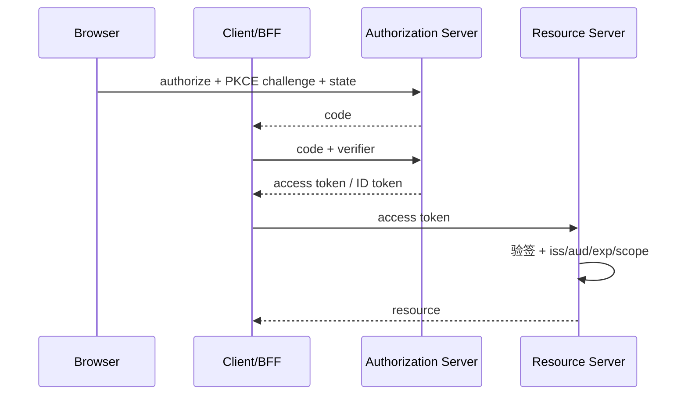

# OAuth 2.0、OIDC、JWT 与 API 安全

OAuth 2.0 是委托授权框架，OIDC 在其上提供身份层，JWT 是一种令牌格式；三者不是同义词。

## 1. 本文覆盖范围

- 授权码与 PKCE
- OIDC ID Token
- JWT 验证
- Refresh token、撤销与资源服务器

## 2. 核心知识详解

### 1. 角色与流程

OAuth 定义 resource owner、client、authorization server 和 resource server。浏览器/移动端通常使用 Authorization Code + PKCE。

- redirect URI 精确匹配，state 防请求关联攻击，nonce 关联 OIDC 登录。
- 公开客户端不保存 client secret。
- 避免隐式授权和资源所有者密码流程。

**正确性边界：** OAuth access token 证明授权，不天然证明用户登录属性；OIDC ID Token 面向 client 身份会话。

### 2. JWT 验证

JWT 是带声明的 JWS/JWE 容器。资源服务器验证签名算法、issuer、audience、有效期、not-before 和业务权限。

- 算法由服务端配置白名单，不信任 header 自选。
- 按 `kid` 获取并缓存可信 JWK，处理轮换。
- 令牌只放必要声明，避免敏感数据和过大 header。

**正确性边界：** Base64URL 编码不是加密；签名 JWT 的 payload 对持有者可见。

### 3. 令牌生命周期

短 access token 限制泄露窗口；refresh token 用于获取新 token，并执行 rotation、重用检测和客户端绑定。

- 撤销、登出、密码/权限变化定义传播延迟。
- 浏览器 token 优先安全 cookie/BFF，降低脚本窃取面。
- 服务间使用专用 client identity 和最小 scope。

**正确性边界：** “无状态 JWT”不代表系统没有状态；密钥、授权、撤销、客户端和审计仍是状态。

### 4. API 防护

API 除身份外还需输入校验、对象级授权、CSRF/CORS、速率限制、审计和秘密管理。

- CORS 是浏览器读取策略，不是认证。
- cookie 认证的状态变更请求使用 CSRF token/SameSite 等防护。
- 输出编码、参数化查询和安全反序列化分别处理不同注入面。

**正确性边界：** 允许任意 Origin 并携带凭据会扩大跨站风险；规则应是明确来源白名单。

## 3. 工程链路



## 4. 最小可运行示例

下面的示例只保留关键路径。把它放入对应版本的最小工程，先运行测试或命令确认行为，再逐步加入重试、超时、监控和异常分支。

```json
{
  "iss": "https://id.example.com",
  "sub": "user-42",
  "aud": ["order-api"],
  "exp": 1785000000,
  "scope": "orders:read orders:write"
}
```

## 5. 实践与验证

1. 画出 BFF 授权码+PKCE流程和威胁点。
2. 为资源服务器写错误 issuer、audience、过期和权限不足测试。
3. 设计 refresh rotation 与重用检测状态。

## 6. 掌握检查

- [ ] 能区分 OAuth/OIDC/JWT。
- [ ] 能完整验证 JWT。
- [ ] 能安全管理 refresh token。
- [ ] 能区分 CORS 与 CSRF。

## 参考资料

- [OAuth 2.0 Security Best Current Practice](https://www.rfc-editor.org/rfc/rfc9700.html)
- [OpenID Connect Core](https://openid.net/specs/openid-connect-core-1_0.html)
- [Spring Security OAuth2](https://docs.spring.io/spring-security/reference/servlet/oauth2/)
