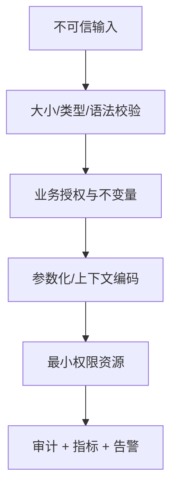

# Java 应用安全：输入、秘密、供应链、文件与审计

应用安全需要把不可信输入限制在语法和业务边界内，并建立秘密、依赖、文件、日志和运行时的纵深防护。

## 1. 本文覆盖范围

- 输入与反序列化
- 文件上传/SSRF/路径
- 秘密与依赖供应链
- 审计、隐私和安全测试

## 2. 核心知识详解

### 1. 输入与输出边界

输入先做长度、类型、格式和业务约束；数据库参数化、HTML 上下文编码、命令参数隔离分别防御不同解释器。

- 禁止把用户值拼进 SQL、shell、模板或表达式。
- JSON 多态反序列化采用类型白名单与大小/深度限制。
- 错误响应稳定且不泄露堆栈、SQL 和内部路径。

**正确性边界：** 单一“过滤特殊字符”不能覆盖不同解释器语法和编码上下文。

### 2. 文件与网络访问

上传验证大小、实际类型、扩展、名称和解压配额，存储在不可执行的独立位置。服务端取 URL 防 DNS 重绑定和内网访问。

- 生成服务端文件名，规范化并确认路径仍在根目录。
- 图片/文档转码放隔离进程并设超时。
- 出站网络默认限制目标、端口和重定向。

**正确性边界：** 只检查文件扩展名或最初 DNS 解析结果不足以覆盖内容伪装与重绑定。

### 3. 秘密和供应链

密钥来自 Secret Manager/KMS 或平台挂载，具备最小权限、轮换、审计和吊销。依赖锁定、SBOM、签名/provenance 和漏洞响应组成供应链控制。

- 仓库凭据不写入 Git、镜像层和构建日志。
- 依赖升级在兼容测试后及时发布。
- CI 的第三方 action/plugin 固定可信版本并限制 token。

**正确性边界：** 环境变量也可能被进程转储、诊断端点或日志泄露，仍需访问控制和最小暴露。

### 4. 审计与验证

安全审计记录主体、动作、资源、结果、时间、来源和关联 ID，并保护完整性。SAST、SCA、DAST、测试和人工评审覆盖不同缺陷。

- 敏感数据脱敏并定义留存、访问与删除。
- 安全事件告警有责任人和处置 runbook。
- 权限、越权、重放和并发竞态写成测试。

**正确性边界：** 应用日志不等于合规审计；后者需要完整性、稳定结构和严格访问。

## 3. 工程链路



## 4. 最小可运行示例

下面的示例只保留关键路径。把它放入对应版本的最小工程，先运行测试或命令确认行为，再逐步加入重试、超时、监控和异常分支。

```yaml
permissions:
  contents: read
jobs:
  build:
    steps:
      - uses: actions/checkout@v5
      - run: ./mvnw -B verify
      - run: syft . -o cyclonedx-json=sbom.json
      - run: cosign attest --predicate sbom.json "$IMAGE"
```

## 5. 实践与验证

1. 为上传接口测试路径穿越、伪造类型、压缩炸弹和超量。
2. 生成 SBOM 并为一个高危依赖写响应步骤。
3. 审查日志并移除 token/密码/个人敏感值。

## 6. 掌握检查

- [ ] 能按解释器选择防护。
- [ ] 能安全处理文件和 SSRF。
- [ ] 能轮换秘密。
- [ ] 能设计可验证审计。

## 参考资料

- [OWASP ASVS](https://owasp.org/www-project-application-security-verification-standard/)
- [OWASP Cheat Sheet Series](https://cheatsheetseries.owasp.org/)
- [CycloneDX Maven Plugin](https://cyclonedx.org/tool-center/)
