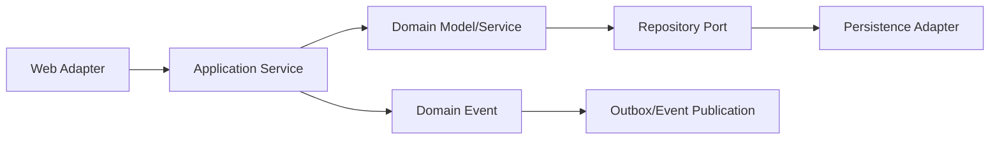

# 应用架构与模块化单体：先学会维护一个单体

> **Freshness metadata**
> - `last_verified`: `2026-08-24`
> - `version_scope`: `Spring Modulith current concepts`
> - `source_type`: `Spring official docs + architecture literature`
> - `stability`: `version-sensitive`

核心问题不是记 DDD 名词，而是：**业务边界如何划分，使代码、事务、测试和团队协作长期可维护**。

## 学习顺序

1. package by layer 与 package by feature 的依赖差异；
2. domain model、bounded context 基础与语言边界；
3. application service 编排 use case，domain service 放置跨实体规则；
4. repository 是领域所需持久化边界，不等于每表一个 DAO；
5. ports & adapters 让业务规则不依赖 HTTP/DB；
6. module verification 与 module integration test；
7. transaction boundary、domain event、outbox、idempotency；
8. 用 observability 看模块交互，再决定是否拆服务。
