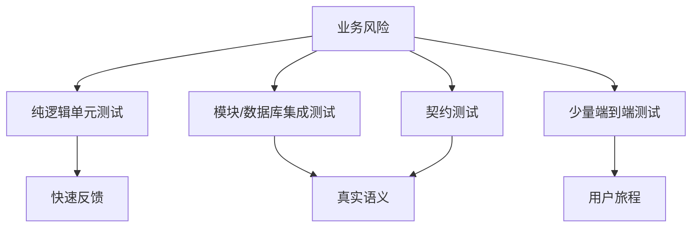

# 测试策略、JUnit 5 与 Mockito

高质量测试验证可观察行为和重要不变量，并在失败时给出定位信息；覆盖率是辅助信号，不是目标本身。

## 1. 本文覆盖范围

- 测试分层与风险
- JUnit 生命周期、参数化与断言
- Mockito test double
- 并发、时间与随机性测试

## 2. 核心知识详解

### 1. 测试分层

单元测试隔离小范围逻辑，组件/集成测试验证模块和真实基础设施，端到端测试覆盖少量关键旅程。数量由风险、速度和维护成本决定。

- 先覆盖核心业务不变量、错误路径和边界值。
- 测试名称描述场景、动作和结果。
- 失败能定位到最近的责任边界，不依赖执行顺序。

**正确性边界：** “测试金字塔”是反馈和成本原则，不要求固定比例，也不排斥高价值集成测试。

### 2. JUnit 5 结构

JUnit Jupiter 用 `@Test`、生命周期、nested、parameterized、dynamic tests 和 extension model 组织测试。

- 每个测试 Arrange/Act/Assert 清晰，公共 fixture 控制大小。
- 参数化测试覆盖等价类和边界，不用复制方法。
- 异常验证同时检查类型和稳定业务字段。

**正确性边界：** 默认测试实例生命周期和并行配置会影响共享可变状态；不要依赖隐式顺序。

### 3. Mockito 的适用边界

mock 适合替换慢、不可控或跨边界依赖；stub 提供输入，spy 包装真实对象，fake 是可工作的简化实现。

- 优先验证返回值和状态，只有协议本身重要时验证交互。
- 不 mock 值对象、集合和被测类内部实现细节。
- 严格 stub 帮助发现未使用或错误调用。

**正确性边界：** 大量 mock 链通常说明设计边界不清，且测试可能与实现耦合。

### 4. 非确定性控制

时间、随机、线程、文件和网络通过显式依赖注入或测试夹具控制。异步测试等待条件而非固定 sleep。

- 注入 Clock 和随机源，固定 seed 并输出失败 seed。
- 并发测试重复运行并配合 JCStress/模型检查验证竞态。
- 资源在 after/try-with-resources 中可靠清理。

**正确性边界：** 单次并发测试通过不能证明没有竞态；需要状态空间、压力和 JVM 内存模型证据。

## 3. 工程链路

## 4. 实践与验证

1. 用参数化测试覆盖价格计算的边界和异常。
2. 重构一个过度 mock 的 service，使领域逻辑可直接测试。
3. 注入 Clock，验证跨日和过期行为。

## 5. 掌握检查

- [ ] 能按风险选测试层。
- [ ] 能正确使用 JUnit fixture。
- [ ] 能说明 mock 代价。
- [ ] 能控制时间和异步非确定性。

## 参考资料

- [JUnit 5 User Guide](https://junit.org/junit5/docs/current/user-guide/)
- [Mockito Documentation](https://site.mockito.org/)
- [OpenJDK JCStress](https://openjdk.org/projects/code-tools/jcstress/)
