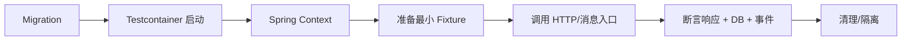

# Spring 集成测试、Testcontainers 与契约测试

框架切片、真实数据库和服务契约测试共同覆盖序列化、事务、SQL、配置和边界兼容性。

## 1. 本文覆盖范围

- Spring TestContext 与 slice
- Testcontainers 真实依赖
- 数据夹具与事务
- HTTP/消息契约测试

## 2. 核心知识详解

### 1. Spring 测试范围

`@SpringBootTest` 启动完整应用上下文，`@WebMvcTest`、`@DataJpaTest` 等 slice 只加载目标层。选择最小能验证风险的范围。

- 上下文缓存要求配置稳定，避免每个测试产生唯一配置。
- MockMvc/WebTestClient 验证路由、序列化、校验和安全。
- 测试配置与生产结构相似，但凭据和外部地址隔离。

**正确性边界：** slice 测试中的 mock 可能掩盖真实序列化或事务问题，关键链路仍需完整集成测试。

### 2. Testcontainers

Testcontainers 用临时 Docker 容器运行与生产同类的数据库、broker 或浏览器，并通过动态属性把地址注入应用。

- 固定受支持镜像版本，等待真实 readiness 条件。
- 容器可按测试类/套件复用，但数据必须隔离。
- CI 预留 Docker、镜像缓存和并发资源。

**正确性边界：** 用 H2 替代 MySQL/PostgreSQL 会隐藏方言、锁、索引和事务差异。

### 3. 数据夹具

fixture 要小、可读且只声明测试相关字段。迁移脚本先执行，再通过 builder、SQL 或 API 准备数据。

- 每个测试拥有独立 schema/事务/唯一租户，避免污染。
- 提交、锁和异步事件测试不依赖自动回滚假象。
- 失败时输出 SQL、容器日志和相关记录。

**正确性边界：** 测试方法自动回滚可能让代码看不到真实 commit 后事件或锁行为。

### 4. 契约测试

provider/consumer contract 把请求、响应、消息 schema 和兼容规则自动化，帮助服务独立发布。

- 消费者只声明真实使用字段和场景。
- 提供者在 CI 验证所有受支持消费者契约。
- breaking change 通过新版本和迁移窗口发布。

**正确性边界：** 契约测试不覆盖提供者内部正确性，也不替代少量端到端链路。

## 3. 工程链路

## 4. 实践与验证

1. 用 PostgreSQL Testcontainer 验证事务隔离和索引查询。
2. 为 REST 接口写 provider/consumer contract。
3. 比较 slice 与完整上下文的覆盖范围和耗时。

## 5. 掌握检查

- [ ] 能选 Spring 测试范围。
- [ ] 能运行真实依赖。
- [ ] 能隔离数据。
- [ ] 能管理契约兼容性。

## 参考资料

- [Testcontainers for Java](https://java.testcontainers.org/)
- [Spring Boot Testing](https://docs.spring.io/spring-boot/reference/testing/)
- [Spring Cloud Contract](https://spring.io/projects/spring-cloud-contract)
