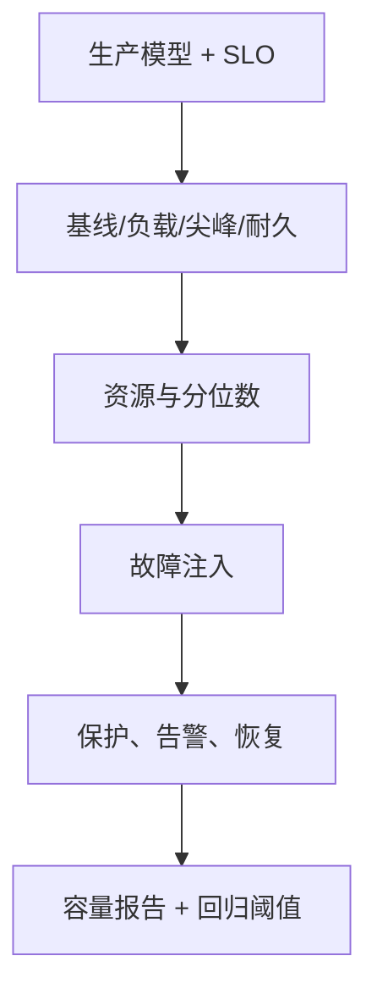

# 性能、稳定性测试与故障演练

性能测试验证容量和 SLO，稳定性测试验证长时间资源行为，故障演练验证系统和团队的恢复能力。

## 1. 本文覆盖范围

- 负载模型与压测工具
- 容量、尖峰、耐久和极限
- 故障注入
- 结果分析与回归基线

## 2. 核心知识详解

### 1. 负载模型

从生产业务量、用户行为和数据分布建立 open/closed workload，定义到达率、并发、think time、大小和读写比。

- 生成器自身 CPU/网络要有余量。
- 测试数据命中真实索引和热点分布。
- 预热缓存/JIT与冷启动分开报告。

**正确性边界：** 只设并发用户数而不说明到达率和等待模型，难以复现实载。

### 2. 场景类型

基线确认单实例，load 验证预期峰值，stress 找拐点，spike 验证突发，soak 发现泄漏，breakpoint 找保护边界。

- 每个场景有 SLO、资源和错误阈值。
- 扩缩容和缓存冷却时间计入。
- 测试结束观察恢复和积压清空。

**正确性边界：** 极限吞吐不等于可运营容量；生产容量需保留故障和增长余量。

### 3. 故障演练

在有停止条件的环境注入延迟、错误、进程终止、节点/网络/依赖故障，观察限流、重试、熔断、迁移和告警。

- 先写稳态指标、假设、爆炸半径和回滚。
- 从单实例和非高峰小流量逐步扩大。
- 同时验证技术恢复和人员 runbook。

**正确性边界：** 随机破坏不是科学实验；没有假设、观测和终止条件只会制造噪声。

### 4. 诊断与基线

把客户端分位数与服务端 RED、JVM、数据库、broker 和网络指标对齐，用 trace/JFR/执行计划解释瓶颈。

- 版本基线保留代码、配置、数据和环境。
- 回归阈值考虑统计波动。
- 容量报告写出最大安全负载和首个饱和资源。

**正确性边界：** 客户端显示超时可能由负载机、网络或服务造成，必须用多侧证据定位。

## 3. 工程链路

## 4. 实践与验证

1. 用 k6/JMeter/Locust 之一建立到达率模型并校验负载机余量。
2. 执行数据库延迟故障，验证 deadline、熔断和恢复。
3. 产出含 p99、资源、饱和点和建议容量的报告。

## 5. 掌握检查

- [ ] 能描述 open/closed 模型。
- [ ] 能区分测试场景。
- [ ] 能安全设计故障实验。
- [ ] 能用跨层证据解释结果。

## 参考资料

- [Apache JMeter](https://jmeter.apache.org/usermanual/)
- [k6 Documentation](https://grafana.com/docs/k6/latest/)
- [Locust Documentation](https://docs.locust.io/)
